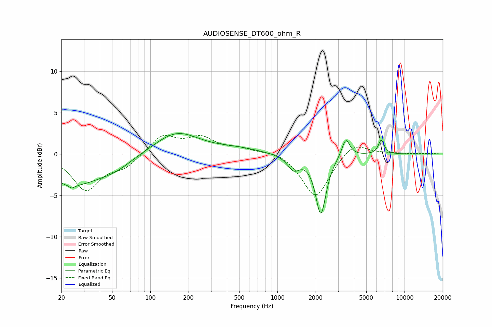

# AUDIOSENSE_DT600_ohm_R
See [usage instructions](https://github.com/jaakkopasanen/AutoEq#usage) for more options and info.

### Parametric EQs
Apply preamp of -2.6 dB when using parametric equalizer.

|   # | Type    |   Fc (Hz) |    Q |   Gain (dB) |
|-----|---------|-----------|------|-------------|
|   1 | Peaking |        23 | 5.98 |         3.2 |
|   2 | Peaking |        23 | 5.62 |        -3.6 |
|   3 | Peaking |        25 | 0.57 |        -3.6 |
|   4 | Peaking |        54 | 1.23 |        -0.7 |
|   5 | Peaking |       161 | 0.81 |         2.7 |
|   6 | Peaking |       482 | 0.83 |         0.5 |
|   7 | Peaking |      1341 | 2.89 |        -1.7 |
|   8 | Peaking |      2196 | 3.42 |        -7.2 |
|   9 | Peaking |      3451 | 4.53 |         2.3 |
|  10 | Peaking |      6559 | 6    |         1.7 |

### Fixed Band EQs
When using fixed band (also called graphic) equalizer, apply preamp of **-2.3 dB** (if available) and set gains manually with these parameters.

|   # | Type    |   Fc (Hz) |    Q |   Gain (dB) |
|-----|---------|-----------|------|-------------|
|   1 | Peaking |        31 | 1.41 |        -4.3 |
|   2 | Peaking |        62 | 1.41 |        -1.4 |
|   3 | Peaking |       125 | 1.41 |         2.3 |
|   4 | Peaking |       250 | 1.41 |         1.8 |
|   5 | Peaking |       500 | 1.41 |         0.6 |
|   6 | Peaking |      1000 | 1.41 |         0.5 |
|   7 | Peaking |      2000 | 1.41 |        -5.3 |
|   8 | Peaking |      4000 | 1.41 |         1.6 |
|   9 | Peaking |      8000 | 1.41 |         0.1 |
|  10 | Peaking |     16000 | 1.41 |         0.1 |

### Graphs

