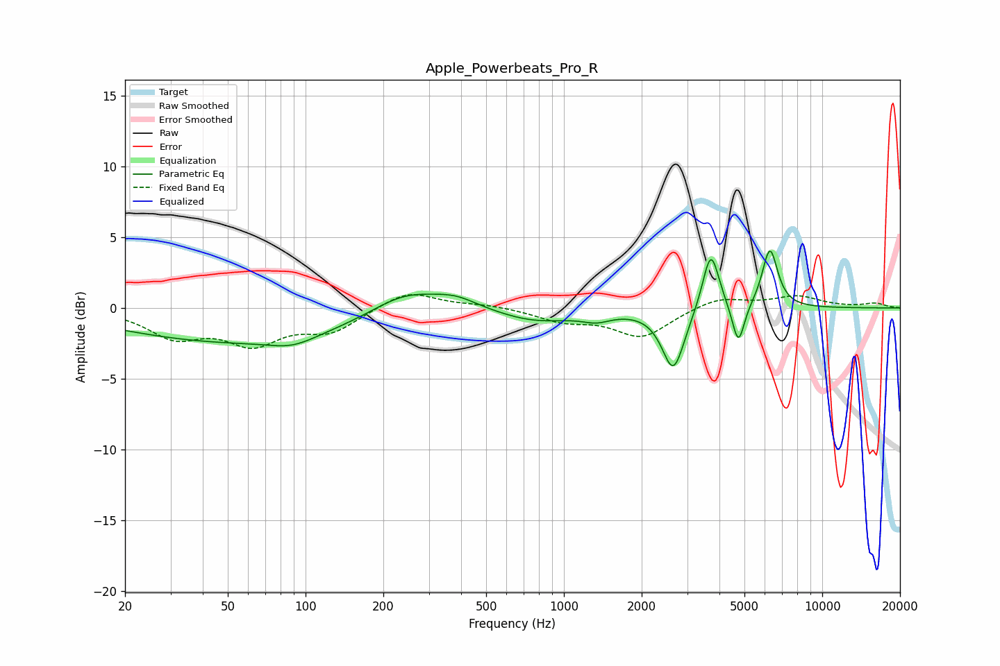

# Apple_Powerbeats_Pro_R
See [usage instructions](https://github.com/jaakkopasanen/AutoEq#usage) for more options and info.

### Parametric EQs
Apply preamp of -4.1 dB when using parametric equalizer.

|   # | Type    |   Fc (Hz) |    Q |   Gain (dB) |
|-----|---------|-----------|------|-------------|
|   1 | Peaking |        54 | 0.3  |        -2.4 |
|   2 | Peaking |        89 | 1.56 |        -0.7 |
|   3 | Peaking |       242 | 1.05 |         1.6 |
|   4 | Peaking |       381 | 1.59 |         0.8 |
|   5 | Peaking |       783 | 0.96 |        -0.9 |
|   6 | Peaking |      1338 | 2.56 |        -0.5 |
|   7 | Peaking |      2653 | 3.27 |        -4.4 |
|   8 | Peaking |      3705 | 4.39 |         4.3 |
|   9 | Peaking |      4735 | 5.96 |        -3   |
|  10 | Peaking |      6273 | 4.58 |         4.2 |

### Fixed Band EQs
When using fixed band (also called graphic) equalizer, apply preamp of **-1.0 dB** (if available) and set gains manually with these parameters.

|   # | Type    |   Fc (Hz) |    Q |   Gain (dB) |
|-----|---------|-----------|------|-------------|
|   1 | Peaking |        31 | 1.41 |        -1.9 |
|   2 | Peaking |        62 | 1.41 |        -2.3 |
|   3 | Peaking |       125 | 1.41 |        -1.5 |
|   4 | Peaking |       250 | 1.41 |         1.3 |
|   5 | Peaking |       500 | 1.41 |         0.2 |
|   6 | Peaking |      1000 | 1.41 |        -0.8 |
|   7 | Peaking |      2000 | 1.41 |        -2   |
|   8 | Peaking |      4000 | 1.41 |         0.8 |
|   9 | Peaking |      8000 | 1.41 |         0.8 |
|  10 | Peaking |     16000 | 1.41 |         0.3 |

### Graphs

