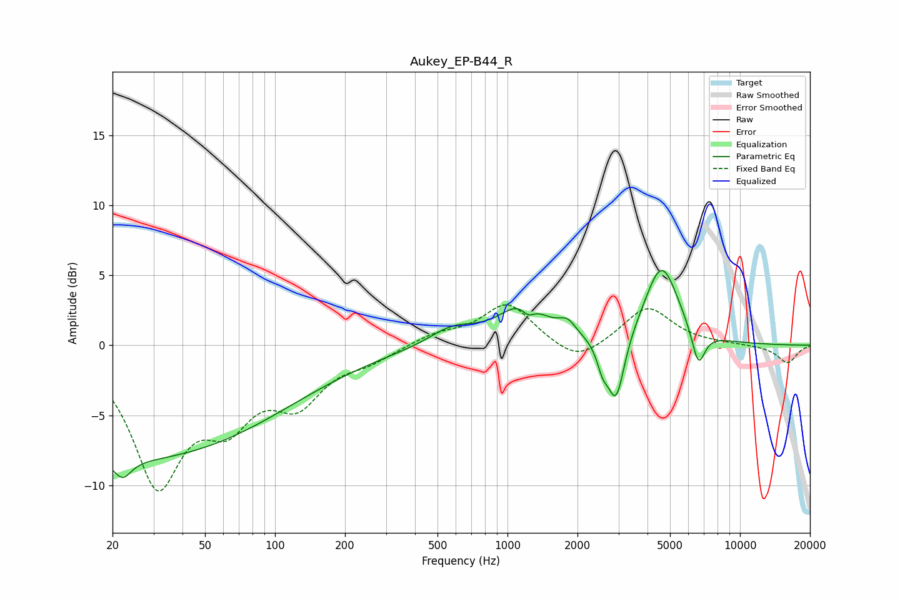

# Aukey_EP-B44_R
See [usage instructions](https://github.com/jaakkopasanen/AutoEq#usage) for more options and info.

### Parametric EQs
Apply preamp of -5.4 dB when using parametric equalizer.

|   # | Type    |   Fc (Hz) |    Q |   Gain (dB) |
|-----|---------|-----------|------|-------------|
|   1 | Peaking |        22 | 0.18 |        -8.2 |
|   2 | Peaking |        22 | 3.97 |        -1.3 |
|   3 | Peaking |       582 | 1.35 |         1.3 |
|   4 | Peaking |      1172 | 1.42 |         2.8 |
|   5 | Peaking |      1229 | 5.09 |        -0.8 |
|   6 | Peaking |      1810 | 3.84 |         0.9 |
|   7 | Peaking |      2563 | 5.9  |        -1.5 |
|   8 | Peaking |      2930 | 3.88 |        -4.8 |
|   9 | Peaking |      4600 | 1.9  |         5.7 |
|  10 | Peaking |      6619 | 4.7  |        -2.7 |

### Fixed Band EQs
When using fixed band (also called graphic) equalizer, apply preamp of **-3.0 dB** (if available) and set gains manually with these parameters.

|   # | Type    |   Fc (Hz) |    Q |   Gain (dB) |
|-----|---------|-----------|------|-------------|
|   1 | Peaking |        31 | 1.41 |        -9.5 |
|   2 | Peaking |        62 | 1.41 |        -4.2 |
|   3 | Peaking |       125 | 1.41 |        -3.6 |
|   4 | Peaking |       250 | 1.41 |        -0.9 |
|   5 | Peaking |       500 | 1.41 |         0.8 |
|   6 | Peaking |      1000 | 1.41 |         3   |
|   7 | Peaking |      2000 | 1.41 |        -1.5 |
|   8 | Peaking |      4000 | 1.41 |         2.8 |
|   9 | Peaking |      8000 | 1.41 |         0.1 |
|  10 | Peaking |     16000 | 1.41 |        -1.3 |

### Graphs

