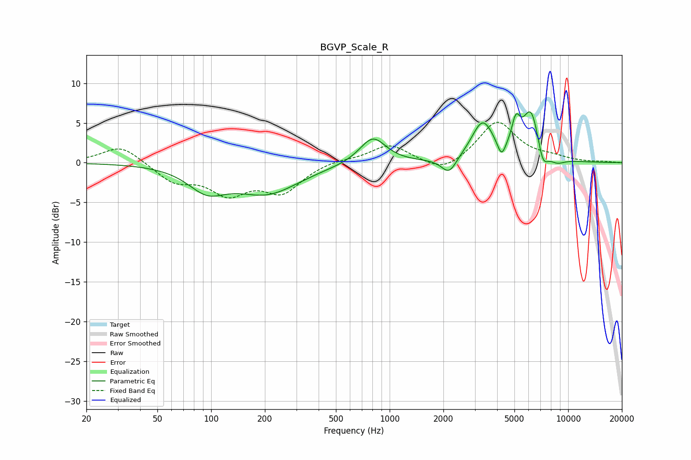

# BGVP_Scale_R
See [usage instructions](https://github.com/jaakkopasanen/AutoEq#usage) for more options and info.

### Parametric EQs
Apply preamp of -6.5 dB when using parametric equalizer.

|   # | Type    |   Fc (Hz) |    Q |   Gain (dB) |
|-----|---------|-----------|------|-------------|
|   1 | Peaking |        95 | 1.36 |        -2.8 |
|   2 | Peaking |       206 | 0.78 |        -3.7 |
|   3 | Peaking |       804 | 1.92 |         3.4 |
|   4 | Peaking |      2153 | 3.34 |        -2.1 |
|   5 | Peaking |      3318 | 2.27 |         4.9 |
|   6 | Peaking |      4234 | 5.98 |        -2.1 |
|   7 | Peaking |      5094 | 5.94 |         3.2 |
|   8 | Peaking |      6203 | 2.79 |         6.4 |
|   9 | Peaking |      7207 | 4.48 |        -2.8 |
|  10 | Peaking |      8642 | 3    |        -0.8 |

### Fixed Band EQs
When using fixed band (also called graphic) equalizer, apply preamp of **-5.2 dB** (if available) and set gains manually with these parameters.

|   # | Type    |   Fc (Hz) |    Q |   Gain (dB) |
|-----|---------|-----------|------|-------------|
|   1 | Peaking |        31 | 1.41 |         2.3 |
|   2 | Peaking |        62 | 1.41 |        -2.3 |
|   3 | Peaking |       125 | 1.41 |        -3.5 |
|   4 | Peaking |       250 | 1.41 |        -3.5 |
|   5 | Peaking |       500 | 1.41 |         0.4 |
|   6 | Peaking |      1000 | 1.41 |         2.3 |
|   7 | Peaking |      2000 | 1.41 |        -1.5 |
|   8 | Peaking |      4000 | 1.41 |         5.2 |
|   9 | Peaking |      8000 | 1.41 |         0.5 |
|  10 | Peaking |     16000 | 1.41 |         0.1 |

### Graphs

