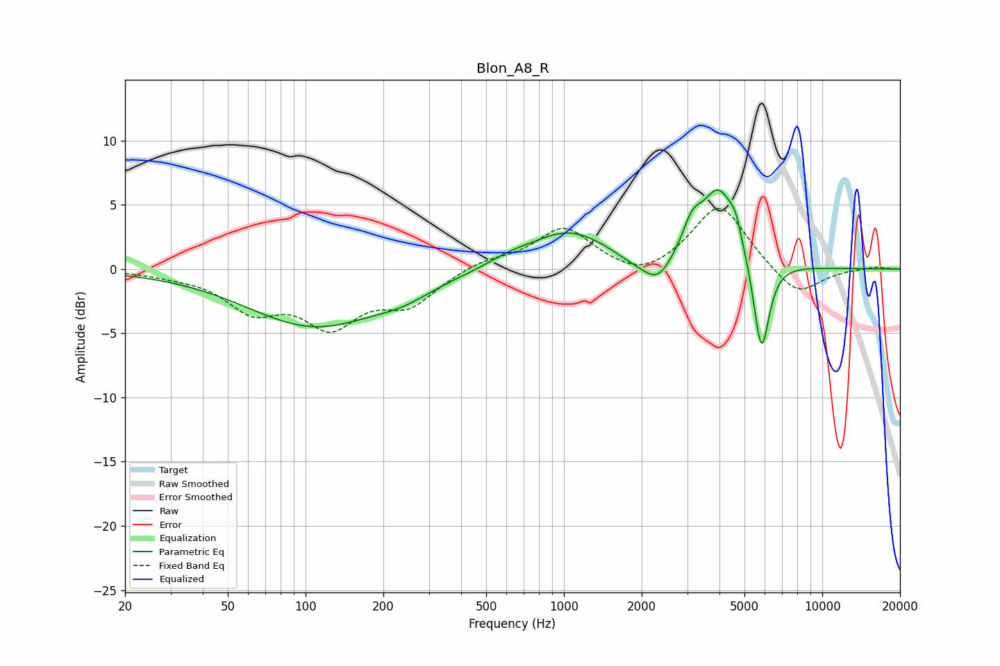

# Blon_A8_R
See [usage instructions](https://github.com/jaakkopasanen/AutoEq#usage) for more options and info.

### Parametric EQs
Apply preamp of -6.2 dB when using parametric equalizer.

|   # | Type    |   Fc (Hz) |    Q |   Gain (dB) |
|-----|---------|-----------|------|-------------|
|   1 | Peaking |       108 | 0.54 |        -4.4 |
|   2 | Peaking |       239 | 1.25 |        -0.8 |
|   3 | Peaking |       611 | 1.83 |         0.4 |
|   4 | Peaking |      1039 | 0.9  |         3   |
|   5 | Peaking |      1839 | 1.97 |        -0.5 |
|   6 | Peaking |      2306 | 2.46 |        -2   |
|   7 | Peaking |      3136 | 3.78 |         2.1 |
|   8 | Peaking |      3976 | 2.05 |         5.9 |
|   9 | Peaking |      4624 | 5.87 |         1.4 |
|  10 | Peaking |      5816 | 4.48 |        -7.6 |

### Fixed Band EQs
When using fixed band (also called graphic) equalizer, apply preamp of **-4.8 dB** (if available) and set gains manually with these parameters.

|   # | Type    |   Fc (Hz) |    Q |   Gain (dB) |
|-----|---------|-----------|------|-------------|
|   1 | Peaking |        31 | 1.41 |        -0.3 |
|   2 | Peaking |        62 | 1.41 |        -2.9 |
|   3 | Peaking |       125 | 1.41 |        -4   |
|   4 | Peaking |       250 | 1.41 |        -2.5 |
|   5 | Peaking |       500 | 1.41 |         0.7 |
|   6 | Peaking |      1000 | 1.41 |         3.2 |
|   7 | Peaking |      2000 | 1.41 |        -1.1 |
|   8 | Peaking |      4000 | 1.41 |         5.1 |
|   9 | Peaking |      8000 | 1.41 |        -2.3 |
|  10 | Peaking |     16000 | 1.41 |         0.2 |

### Graphs

