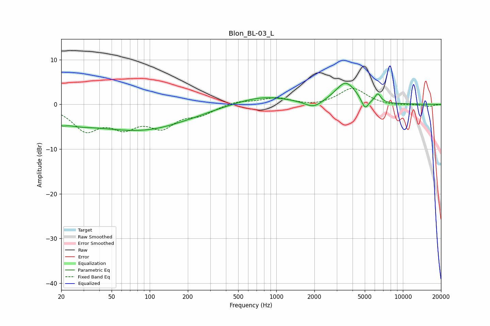

# Blon_BL-03_L
See [usage instructions](https://github.com/jaakkopasanen/AutoEq#usage) for more options and info.

### Parametric EQs
Apply preamp of -4.8 dB when using parametric equalizer.

|   # | Type    |   Fc (Hz) |    Q |   Gain (dB) |
|-----|---------|-----------|------|-------------|
|   1 | Peaking |        20 | 4.03 |        -1.1 |
|   2 | Peaking |        26 | 1.21 |        -1.2 |
|   3 | Peaking |        67 | 0.29 |        -4.6 |
|   4 | Peaking |        99 | 0.53 |        -1.3 |
|   5 | Peaking |       243 | 1.57 |        -0.1 |
|   6 | Peaking |       776 | 0.66 |         1.9 |
|   7 | Peaking |      1968 | 2.11 |        -1.7 |
|   8 | Peaking |      3532 | 1.74 |         4.9 |
|   9 | Peaking |      5023 | 5.01 |        -2.5 |
|  10 | Peaking |      6335 | 6    |         1.9 |

### Fixed Band EQs
When using fixed band (also called graphic) equalizer, apply preamp of **-3.7 dB** (if available) and set gains manually with these parameters.

|   # | Type    |   Fc (Hz) |    Q |   Gain (dB) |
|-----|---------|-----------|------|-------------|
|   1 | Peaking |        31 | 1.41 |        -5.3 |
|   2 | Peaking |        62 | 1.41 |        -4.2 |
|   3 | Peaking |       125 | 1.41 |        -4.5 |
|   4 | Peaking |       250 | 1.41 |        -1.9 |
|   5 | Peaking |       500 | 1.41 |         0.8 |
|   6 | Peaking |      1000 | 1.41 |         1.5 |
|   7 | Peaking |      2000 | 1.41 |        -0.4 |
|   8 | Peaking |      4000 | 1.41 |         3.7 |
|   9 | Peaking |      8000 | 1.41 |        -0.3 |
|  10 | Peaking |     16000 | 1.41 |        -0.5 |

### Graphs

