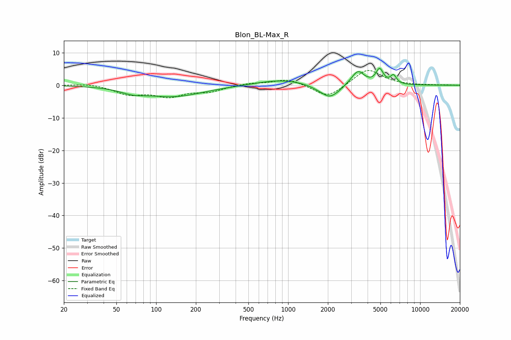

# Blon_BL-Max_R
See [usage instructions](https://github.com/jaakkopasanen/AutoEq#usage) for more options and info.

### Parametric EQs
Apply preamp of -5.3 dB when using parametric equalizer.

|   # | Type    |   Fc (Hz) |    Q |   Gain (dB) |
|-----|---------|-----------|------|-------------|
|   1 | Peaking |        66 | 1.6  |        -1.3 |
|   2 | Peaking |       136 | 0.63 |        -3.4 |
|   3 | Peaking |       878 | 0.78 |         1.7 |
|   4 | Peaking |      1712 | 2.08 |        -0.8 |
|   5 | Peaking |      2062 | 2.37 |        -3.4 |
|   6 | Peaking |      2411 | 3.27 |        -0.7 |
|   7 | Peaking |      3377 | 2.94 |         4.4 |
|   8 | Peaking |      4828 | 5.89 |         0.7 |
|   9 | Peaking |      4952 | 5.06 |         3.8 |
|  10 | Peaking |      6279 | 5.96 |         2.6 |

### Fixed Band EQs
When using fixed band (also called graphic) equalizer, apply preamp of **-4.6 dB** (if available) and set gains manually with these parameters.

|   # | Type    |   Fc (Hz) |    Q |   Gain (dB) |
|-----|---------|-----------|------|-------------|
|   1 | Peaking |        31 | 1.41 |         0.6 |
|   2 | Peaking |        62 | 1.41 |        -2.6 |
|   3 | Peaking |       125 | 1.41 |        -3.1 |
|   4 | Peaking |       250 | 1.41 |        -1.8 |
|   5 | Peaking |       500 | 1.41 |         0.7 |
|   6 | Peaking |      1000 | 1.41 |         2   |
|   7 | Peaking |      2000 | 1.41 |        -4   |
|   8 | Peaking |      4000 | 1.41 |         5.2 |
|   9 | Peaking |      8000 | 1.41 |         0   |
|  10 | Peaking |     16000 | 1.41 |         0.1 |

### Graphs

