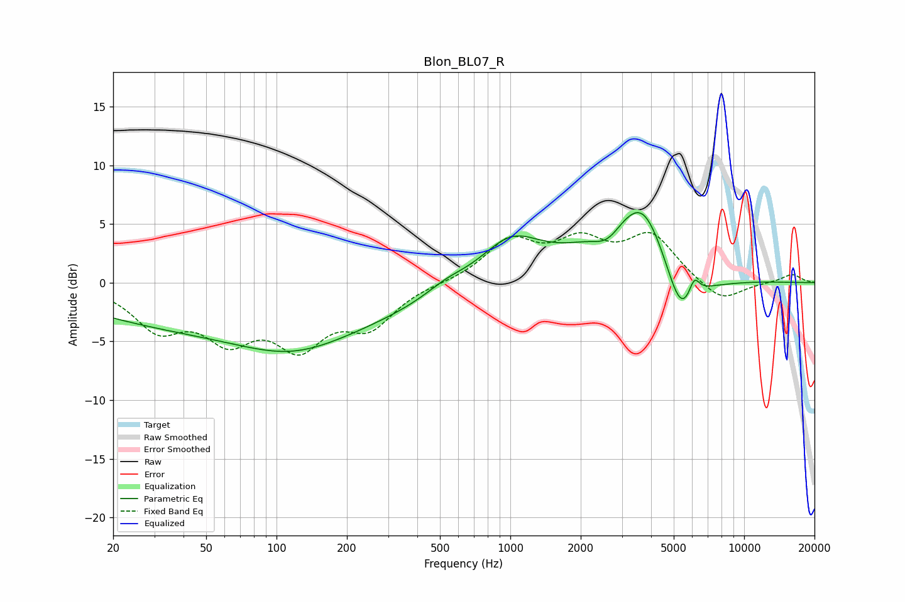

# Blon_BL07_R
See [usage instructions](https://github.com/jaakkopasanen/AutoEq#usage) for more options and info.

### Parametric EQs
Apply preamp of -6.1 dB when using parametric equalizer.

|   # | Type    |   Fc (Hz) |    Q |   Gain (dB) |
|-----|---------|-----------|------|-------------|
|   1 | Peaking |        76 | 0.18 |        -4.1 |
|   2 | Peaking |       117 | 0.65 |        -1.9 |
|   3 | Peaking |       531 | 1.58 |         0.8 |
|   4 | Peaking |      1005 | 1.08 |         3.6 |
|   5 | Peaking |      2604 | 2.22 |        -1.7 |
|   6 | Peaking |      3459 | 0.76 |         6.3 |
|   7 | Peaking |      3716 | 2.1  |         1.6 |
|   8 | Peaking |      5372 | 2.02 |        -5.4 |
|   9 | Peaking |      6114 | 5.88 |         1.7 |
|  10 | Peaking |      7036 | 0.9  |        -1.1 |

### Fixed Band EQs
When using fixed band (also called graphic) equalizer, apply preamp of **-4.4 dB** (if available) and set gains manually with these parameters.

|   # | Type    |   Fc (Hz) |    Q |   Gain (dB) |
|-----|---------|-----------|------|-------------|
|   1 | Peaking |        31 | 1.41 |        -3.6 |
|   2 | Peaking |        62 | 1.41 |        -4.1 |
|   3 | Peaking |       125 | 1.41 |        -4.7 |
|   4 | Peaking |       250 | 1.41 |        -3.3 |
|   5 | Peaking |       500 | 1.41 |        -0   |
|   6 | Peaking |      1000 | 1.41 |         3.4 |
|   7 | Peaking |      2000 | 1.41 |         3   |
|   8 | Peaking |      4000 | 1.41 |         3.8 |
|   9 | Peaking |      8000 | 1.41 |        -1.8 |
|  10 | Peaking |     16000 | 1.41 |         0.7 |

### Graphs

