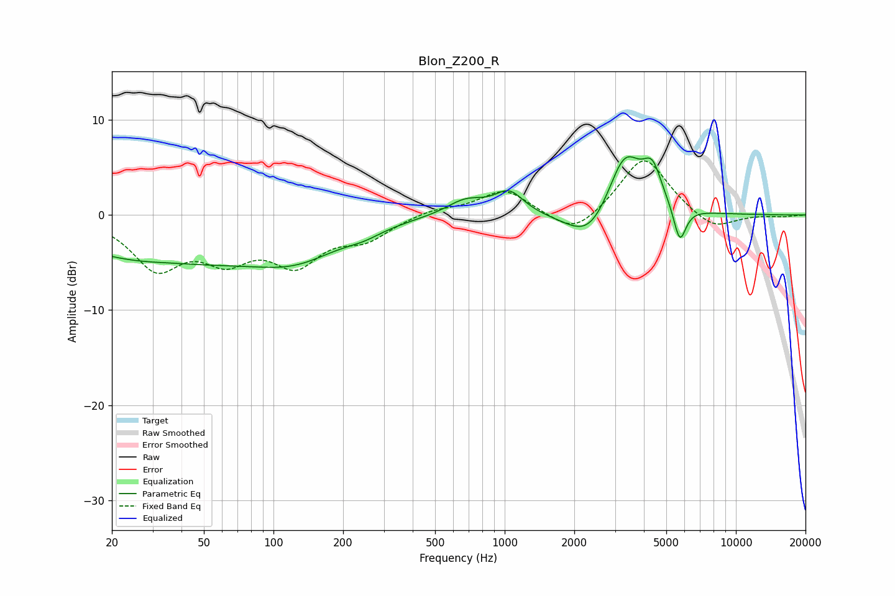

# Blon_Z200_R
See [usage instructions](https://github.com/jaakkopasanen/AutoEq#usage) for more options and info.

### Parametric EQs
Apply preamp of -6.2 dB when using parametric equalizer.

|   # | Type    |   Fc (Hz) |    Q |   Gain (dB) |
|-----|---------|-----------|------|-------------|
|   1 | Peaking |        34 | 0.35 |        -5.1 |
|   2 | Peaking |        37 | 0.94 |         0.5 |
|   3 | Peaking |       127 | 0.75 |        -3.1 |
|   4 | Peaking |       246 | 1.73 |        -0.7 |
|   5 | Peaking |       679 | 1.66 |         1.7 |
|   6 | Peaking |      1046 | 2.25 |         2.4 |
|   7 | Peaking |      2334 | 1.41 |        -3.6 |
|   8 | Peaking |      3301 | 1.85 |         6.9 |
|   9 | Peaking |      4352 | 3.39 |         3.7 |
|  10 | Peaking |      5720 | 5.15 |        -3.9 |

### Fixed Band EQs
When using fixed band (also called graphic) equalizer, apply preamp of **-5.8 dB** (if available) and set gains manually with these parameters.

|   # | Type    |   Fc (Hz) |    Q |   Gain (dB) |
|-----|---------|-----------|------|-------------|
|   1 | Peaking |        31 | 1.41 |        -5.2 |
|   2 | Peaking |        62 | 1.41 |        -3.8 |
|   3 | Peaking |       125 | 1.41 |        -4.6 |
|   4 | Peaking |       250 | 1.41 |        -2.2 |
|   5 | Peaking |       500 | 1.41 |         0.7 |
|   6 | Peaking |      1000 | 1.41 |         2.7 |
|   7 | Peaking |      2000 | 1.41 |        -2.5 |
|   8 | Peaking |      4000 | 1.41 |         6.3 |
|   9 | Peaking |      8000 | 1.41 |        -1.8 |
|  10 | Peaking |     16000 | 1.41 |        -0.2 |

### Graphs

