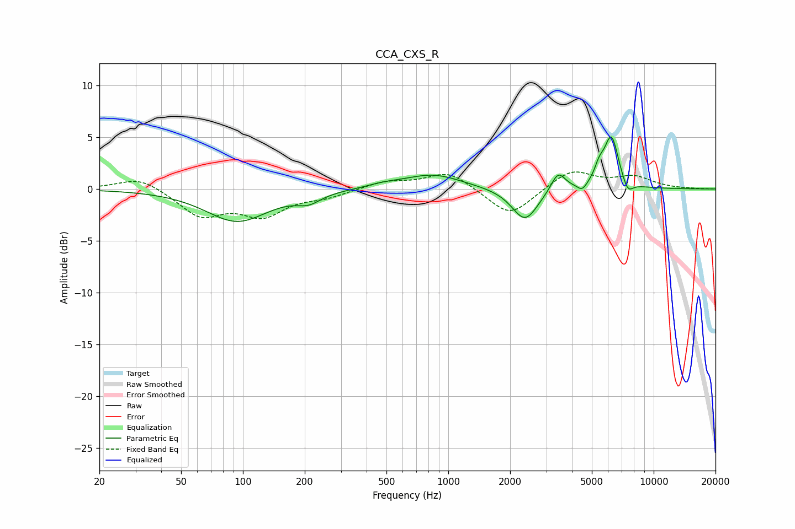

# CCA_CXS_R
See [usage instructions](https://github.com/jaakkopasanen/AutoEq#usage) for more options and info.

### Parametric EQs
Apply preamp of -5.1 dB when using parametric equalizer.

|   # | Type    |   Fc (Hz) |    Q |   Gain (dB) |
|-----|---------|-----------|------|-------------|
|   1 | Peaking |        94 | 0.93 |        -3.1 |
|   2 | Peaking |       209 | 2.45 |        -0.8 |
|   3 | Peaking |       484 | 1.69 |         0.3 |
|   4 | Peaking |       842 | 1.01 |         1.4 |
|   5 | Peaking |      2364 | 2.23 |        -3.2 |
|   6 | Peaking |      3427 | 4.03 |         1.9 |
|   7 | Peaking |      4490 | 6    |        -0.7 |
|   8 | Peaking |      5431 | 5.99 |         1.2 |
|   9 | Peaking |      6224 | 3.85 |         5   |
|  10 | Peaking |      7473 | 5.21 |        -1.2 |

### Fixed Band EQs
When using fixed band (also called graphic) equalizer, apply preamp of **-1.7 dB** (if available) and set gains manually with these parameters.

|   # | Type    |   Fc (Hz) |    Q |   Gain (dB) |
|-----|---------|-----------|------|-------------|
|   1 | Peaking |        31 | 1.41 |         1.2 |
|   2 | Peaking |        62 | 1.41 |        -2.5 |
|   3 | Peaking |       125 | 1.41 |        -2.3 |
|   4 | Peaking |       250 | 1.41 |        -0.7 |
|   5 | Peaking |       500 | 1.41 |         0.7 |
|   6 | Peaking |      1000 | 1.41 |         1.7 |
|   7 | Peaking |      2000 | 1.41 |        -2.7 |
|   8 | Peaking |      4000 | 1.41 |         1.9 |
|   9 | Peaking |      8000 | 1.41 |         1.1 |
|  10 | Peaking |     16000 | 1.41 |        -0   |

### Graphs

