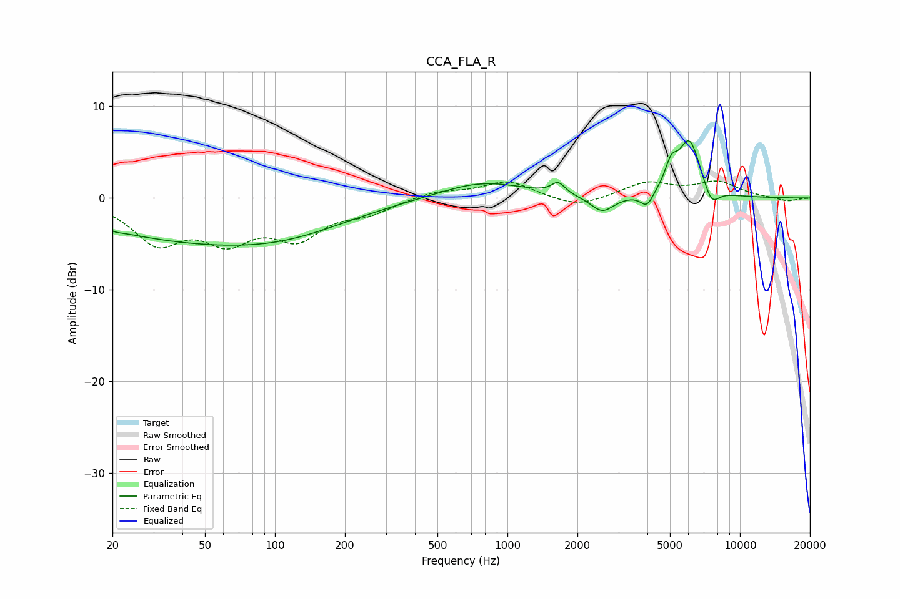

# CCA_FLA_R
See [usage instructions](https://github.com/jaakkopasanen/AutoEq#usage) for more options and info.

### Parametric EQs
Apply preamp of -6.4 dB when using parametric equalizer.

|   # | Type    |   Fc (Hz) |    Q |   Gain (dB) |
|-----|---------|-----------|------|-------------|
|   1 | Peaking |        21 | 5.83 |        -0.1 |
|   2 | Peaking |        48 | 0.28 |        -4.5 |
|   3 | Peaking |       117 | 0.55 |        -1.2 |
|   4 | Peaking |       783 | 0.78 |         1.8 |
|   5 | Peaking |      1653 | 4.94 |         1.2 |
|   6 | Peaking |      2558 | 2.79 |        -1.8 |
|   7 | Peaking |      3982 | 5.12 |        -1.6 |
|   8 | Peaking |      5059 | 5.21 |         2.4 |
|   9 | Peaking |      6064 | 2.84 |         6.2 |
|  10 | Peaking |      7534 | 4.08 |        -2.1 |

### Fixed Band EQs
When using fixed band (also called graphic) equalizer, apply preamp of **-2.0 dB** (if available) and set gains manually with these parameters.

|   # | Type    |   Fc (Hz) |    Q |   Gain (dB) |
|-----|---------|-----------|------|-------------|
|   1 | Peaking |        31 | 1.41 |        -4.5 |
|   2 | Peaking |        62 | 1.41 |        -4   |
|   3 | Peaking |       125 | 1.41 |        -3.9 |
|   4 | Peaking |       250 | 1.41 |        -1.4 |
|   5 | Peaking |       500 | 1.41 |         0.8 |
|   6 | Peaking |      1000 | 1.41 |         1.8 |
|   7 | Peaking |      2000 | 1.41 |        -1.1 |
|   8 | Peaking |      4000 | 1.41 |         1.6 |
|   9 | Peaking |      8000 | 1.41 |         1.7 |
|  10 | Peaking |     16000 | 1.41 |        -0.4 |

### Graphs

