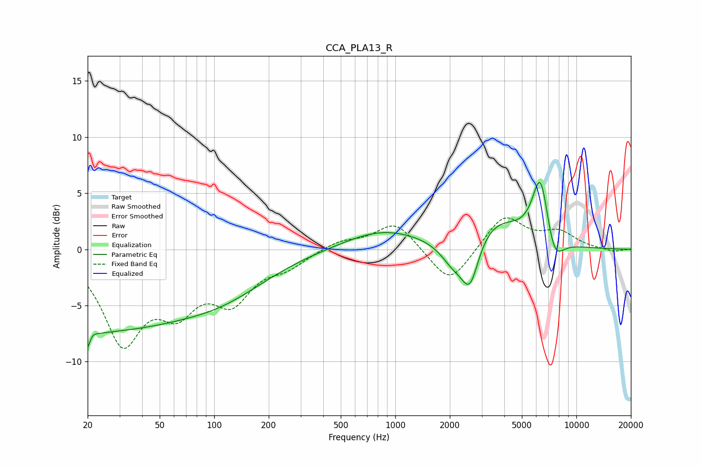

# CCA_PLA13_R
See [usage instructions](https://github.com/jaakkopasanen/AutoEq#usage) for more options and info.

### Parametric EQs
Apply preamp of -6.1 dB when using parametric equalizer.

|   # | Type    |   Fc (Hz) |    Q |   Gain (dB) |
|-----|---------|-----------|------|-------------|
|   1 | Peaking |        20 | 0.23 |        -7   |
|   2 | Peaking |        20 | 5.17 |        -4.7 |
|   3 | Peaking |        21 | 5.44 |         3.5 |
|   4 | Peaking |       118 | 0.56 |        -2.3 |
|   5 | Peaking |       853 | 0.66 |         1.7 |
|   6 | Peaking |      2089 | 1.97 |        -2   |
|   7 | Peaking |      2584 | 2.88 |        -4.2 |
|   8 | Peaking |      3541 | 0.96 |         2.6 |
|   9 | Peaking |      6335 | 3    |         6.2 |
|  10 | Peaking |      7530 | 2.73 |        -2.7 |

### Fixed Band EQs
When using fixed band (also called graphic) equalizer, apply preamp of **-2.9 dB** (if available) and set gains manually with these parameters.

|   # | Type    |   Fc (Hz) |    Q |   Gain (dB) |
|-----|---------|-----------|------|-------------|
|   1 | Peaking |        31 | 1.41 |        -7.9 |
|   2 | Peaking |        62 | 1.41 |        -4.3 |
|   3 | Peaking |       125 | 1.41 |        -4   |
|   4 | Peaking |       250 | 1.41 |        -1.3 |
|   5 | Peaking |       500 | 1.41 |         0.8 |
|   6 | Peaking |      1000 | 1.41 |         2.5 |
|   7 | Peaking |      2000 | 1.41 |        -3.3 |
|   8 | Peaking |      4000 | 1.41 |         3.1 |
|   9 | Peaking |      8000 | 1.41 |         1.4 |
|  10 | Peaking |     16000 | 1.41 |        -0.2 |

### Graphs

