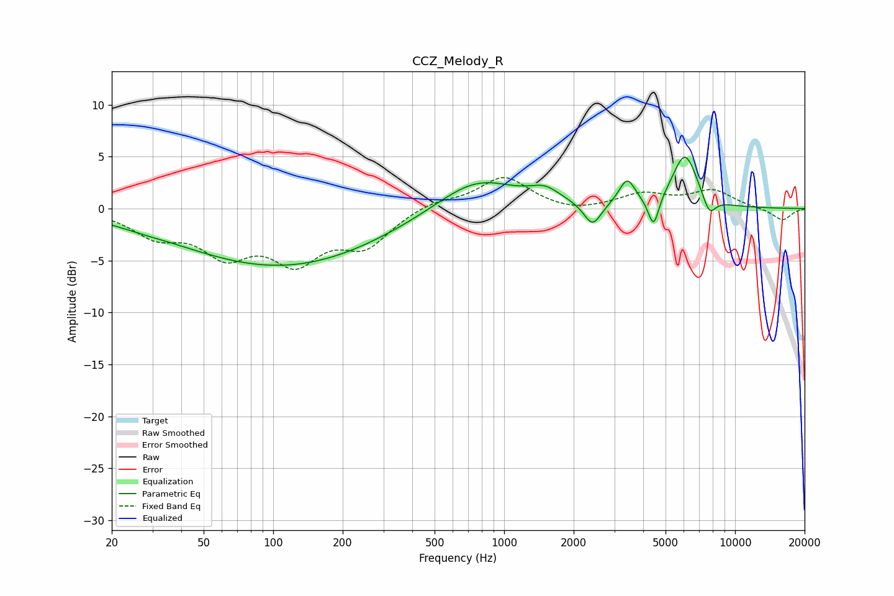

# CCZ_Melody_R
See [usage instructions](https://github.com/jaakkopasanen/AutoEq#usage) for more options and info.

### Parametric EQs
Apply preamp of -5.0 dB when using parametric equalizer.

|   # | Type    |   Fc (Hz) |    Q |   Gain (dB) |
|-----|---------|-----------|------|-------------|
|   1 | Peaking |        27 | 1.59 |        -0.2 |
|   2 | Peaking |        93 | 0.35 |        -4.9 |
|   3 | Peaking |       228 | 0.46 |        -1.1 |
|   4 | Peaking |       761 | 0.82 |         3.2 |
|   5 | Peaking |      1503 | 2.17 |         1.2 |
|   6 | Peaking |      2415 | 3.74 |        -2.3 |
|   7 | Peaking |      3410 | 4.01 |         2.5 |
|   8 | Peaking |      4438 | 6    |        -3   |
|   9 | Peaking |      6070 | 2.49 |         5.2 |
|  10 | Peaking |      7724 | 4.67 |        -1.8 |

### Fixed Band EQs
When using fixed band (also called graphic) equalizer, apply preamp of **-3.1 dB** (if available) and set gains manually with these parameters.

|   # | Type    |   Fc (Hz) |    Q |   Gain (dB) |
|-----|---------|-----------|------|-------------|
|   1 | Peaking |        31 | 1.41 |        -2.3 |
|   2 | Peaking |        62 | 1.41 |        -3.9 |
|   3 | Peaking |       125 | 1.41 |        -4.5 |
|   4 | Peaking |       250 | 1.41 |        -3.3 |
|   5 | Peaking |       500 | 1.41 |         0.8 |
|   6 | Peaking |      1000 | 1.41 |         3   |
|   7 | Peaking |      2000 | 1.41 |        -0.5 |
|   8 | Peaking |      4000 | 1.41 |         1.3 |
|   9 | Peaking |      8000 | 1.41 |         1.7 |
|  10 | Peaking |     16000 | 1.41 |        -1.2 |

### Graphs

