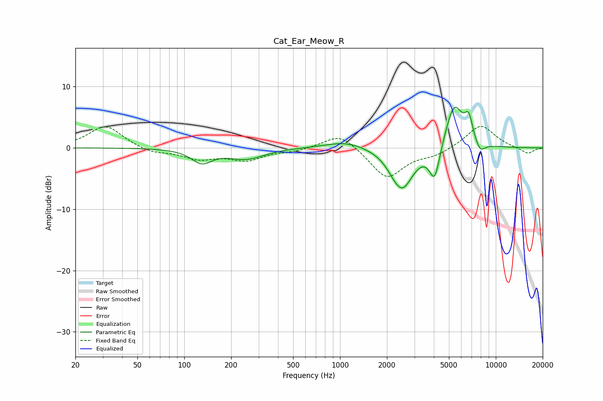

# Cat_Ear_Meow_R
See [usage instructions](https://github.com/jaakkopasanen/AutoEq#usage) for more options and info.

### Parametric EQs
Apply preamp of -6.7 dB when using parametric equalizer.

|   # | Type    |   Fc (Hz) |    Q |   Gain (dB) |
|-----|---------|-----------|------|-------------|
|   1 | Peaking |       130 | 2.14 |        -2.2 |
|   2 | Peaking |       250 | 1.26 |        -1.7 |
|   3 | Peaking |      1097 | 1.08 |         1.2 |
|   4 | Peaking |      2190 | 3.31 |        -0.5 |
|   5 | Peaking |      2510 | 1.97 |        -6.6 |
|   6 | Peaking |      4054 | 4.11 |        -5.6 |
|   7 | Peaking |      5401 | 2.39 |         7.4 |
|   8 | Peaking |      6703 | 5.09 |         3.6 |
|   9 | Peaking |      7879 | 3.2  |        -0.5 |
|  10 | Peaking |      7926 | 4.45 |        -1.3 |

### Fixed Band EQs
When using fixed band (also called graphic) equalizer, apply preamp of **-3.6 dB** (if available) and set gains manually with these parameters.

|   # | Type    |   Fc (Hz) |    Q |   Gain (dB) |
|-----|---------|-----------|------|-------------|
|   1 | Peaking |        31 | 1.41 |         3.7 |
|   2 | Peaking |        62 | 1.41 |        -0.9 |
|   3 | Peaking |       125 | 1.41 |        -1.6 |
|   4 | Peaking |       250 | 1.41 |        -1.9 |
|   5 | Peaking |       500 | 1.41 |        -0.5 |
|   6 | Peaking |      1000 | 1.41 |         2.6 |
|   7 | Peaking |      2000 | 1.41 |        -5   |
|   8 | Peaking |      4000 | 1.41 |        -1.1 |
|   9 | Peaking |      8000 | 1.41 |         3.8 |
|  10 | Peaking |     16000 | 1.41 |        -1   |

### Graphs

