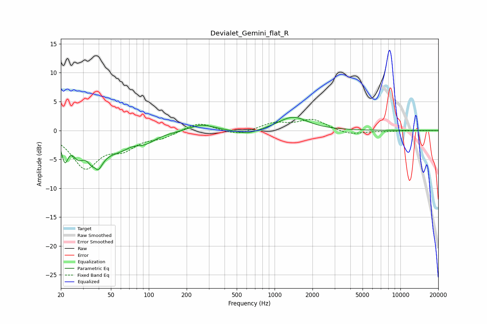

# Devialet_Gemini_flat_R
See [usage instructions](https://github.com/jaakkopasanen/AutoEq#usage) for more options and info.

### Parametric EQs
Apply preamp of -2.4 dB when using parametric equalizer.

|   # | Type    |   Fc (Hz) |    Q |   Gain (dB) |
|-----|---------|-----------|------|-------------|
|   1 | Peaking |        22 | 5.79 |        -3.8 |
|   2 | Peaking |        27 | 3.2  |        -2.7 |
|   3 | Peaking |        37 | 5.98 |         2.5 |
|   4 | Peaking |        38 | 3.35 |        -6.4 |
|   5 | Peaking |        57 | 0.89 |        -3.1 |
|   6 | Peaking |        75 | 2.32 |         0.5 |
|   7 | Peaking |        94 | 1.98 |        -0.9 |
|   8 | Peaking |       262 | 1.44 |         1.2 |
|   9 | Peaking |       610 | 1.53 |        -0.8 |
|  10 | Peaking |      1398 | 1.22 |         2.3 |

### Fixed Band EQs
When using fixed band (also called graphic) equalizer, apply preamp of **-2.0 dB** (if available) and set gains manually with these parameters.

|   # | Type    |   Fc (Hz) |    Q |   Gain (dB) |
|-----|---------|-----------|------|-------------|
|   1 | Peaking |        31 | 1.41 |        -6.2 |
|   2 | Peaking |        62 | 1.41 |        -2.6 |
|   3 | Peaking |       125 | 1.41 |        -1   |
|   4 | Peaking |       250 | 1.41 |         1.5 |
|   5 | Peaking |       500 | 1.41 |        -0.9 |
|   6 | Peaking |      1000 | 1.41 |         1.2 |
|   7 | Peaking |      2000 | 1.41 |         1.8 |
|   8 | Peaking |      4000 | 1.41 |        -0.8 |
|   9 | Peaking |      8000 | 1.41 |        -0.1 |
|  10 | Peaking |     16000 | 1.41 |        -0   |

### Graphs

