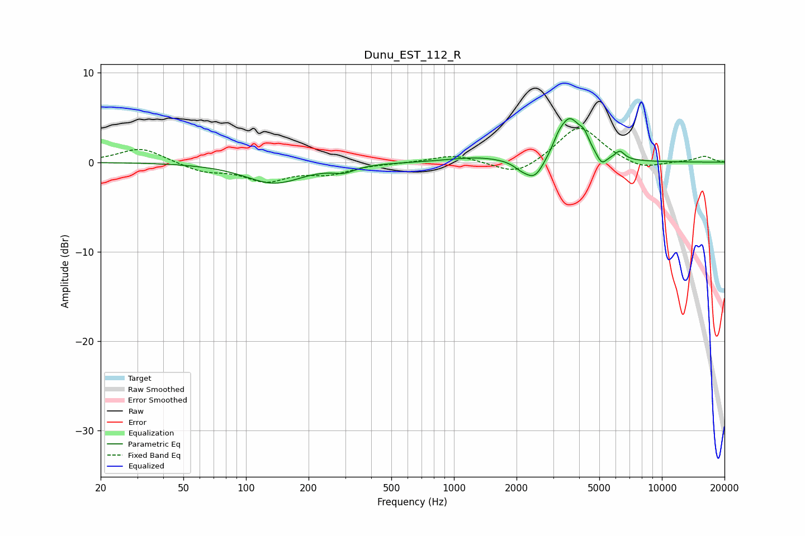

# Dunu_EST_112_R
See [usage instructions](https://github.com/jaakkopasanen/AutoEq#usage) for more options and info.

### Parametric EQs
Apply preamp of -5.0 dB when using parametric equalizer.

|   # | Type    |   Fc (Hz) |    Q |   Gain (dB) |
|-----|---------|-----------|------|-------------|
|   1 | Peaking |       136 | 1.01 |        -2.3 |
|   2 | Peaking |       295 | 2.63 |        -0.7 |
|   3 | Peaking |      1292 | 1.03 |         0.5 |
|   4 | Peaking |      2088 | 4.09 |        -0.5 |
|   5 | Peaking |      2441 | 2.88 |        -2.4 |
|   6 | Peaking |      3177 | 6    |         0.6 |
|   7 | Peaking |      3590 | 2.54 |         4.8 |
|   8 | Peaking |      4232 | 5.9  |         1.2 |
|   9 | Peaking |      5139 | 6    |        -1.2 |
|  10 | Peaking |      6275 | 6    |         0.9 |

### Fixed Band EQs
When using fixed band (also called graphic) equalizer, apply preamp of **-3.9 dB** (if available) and set gains manually with these parameters.

|   # | Type    |   Fc (Hz) |    Q |   Gain (dB) |
|-----|---------|-----------|------|-------------|
|   1 | Peaking |        31 | 1.41 |         1.7 |
|   2 | Peaking |        62 | 1.41 |        -1   |
|   3 | Peaking |       125 | 1.41 |        -1.9 |
|   4 | Peaking |       250 | 1.41 |        -1.1 |
|   5 | Peaking |       500 | 1.41 |        -0.1 |
|   6 | Peaking |      1000 | 1.41 |         0.8 |
|   7 | Peaking |      2000 | 1.41 |        -1.6 |
|   8 | Peaking |      4000 | 1.41 |         4.2 |
|   9 | Peaking |      8000 | 1.41 |        -0.9 |
|  10 | Peaking |     16000 | 1.41 |         0.7 |

### Graphs

