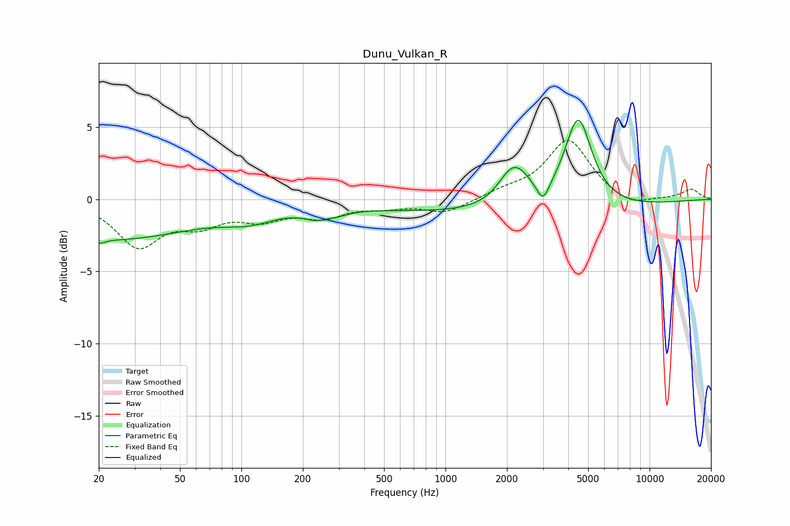

# Dunu_Vulkan_R
See [usage instructions](https://github.com/jaakkopasanen/AutoEq#usage) for more options and info.

### Parametric EQs
Apply preamp of -5.6 dB when using parametric equalizer.

|   # | Type    |   Fc (Hz) |    Q |   Gain (dB) |
|-----|---------|-----------|------|-------------|
|   1 | Peaking |        20 | 5.63 |        -0.3 |
|   2 | Peaking |        22 | 0.33 |        -2.7 |
|   3 | Peaking |       110 | 1.05 |        -0.9 |
|   4 | Peaking |       254 | 2.11 |        -1.5 |
|   5 | Peaking |       258 | 3    |         0.8 |
|   6 | Peaking |      2066 | 0.18 |        -1   |
|   7 | Peaking |      2104 | 2.09 |         2.1 |
|   8 | Peaking |      2362 | 2.19 |         0.9 |
|   9 | Peaking |      3005 | 4.83 |        -1.3 |
|  10 | Peaking |      4471 | 2.12 |         6.2 |

### Fixed Band EQs
When using fixed band (also called graphic) equalizer, apply preamp of **-4.2 dB** (if available) and set gains manually with these parameters.

|   # | Type    |   Fc (Hz) |    Q |   Gain (dB) |
|-----|---------|-----------|------|-------------|
|   1 | Peaking |        31 | 1.41 |        -3.1 |
|   2 | Peaking |        62 | 1.41 |        -1.4 |
|   3 | Peaking |       125 | 1.41 |        -1.2 |
|   4 | Peaking |       250 | 1.41 |        -1.1 |
|   5 | Peaking |       500 | 1.41 |        -0.4 |
|   6 | Peaking |      1000 | 1.41 |        -0.9 |
|   7 | Peaking |      2000 | 1.41 |         0.5 |
|   8 | Peaking |      4000 | 1.41 |         4.1 |
|   9 | Peaking |      8000 | 1.41 |        -0.6 |
|  10 | Peaking |     16000 | 1.41 |         0.7 |

### Graphs

