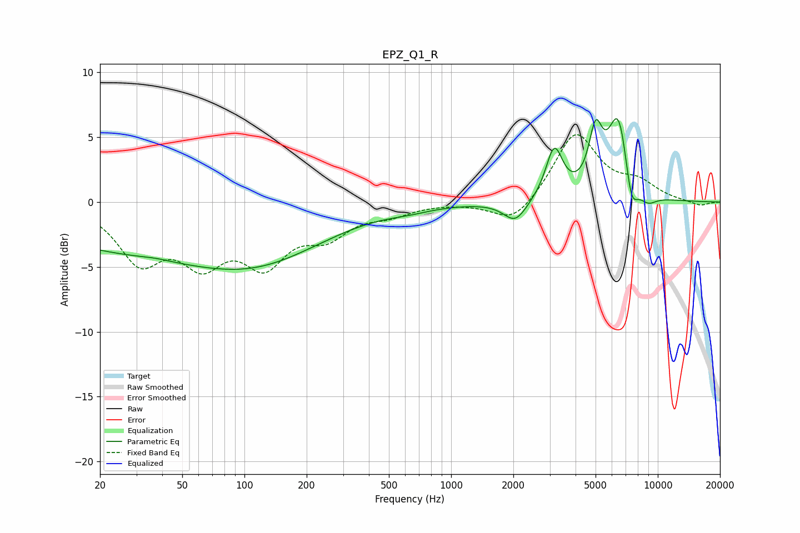

# EPZ_Q1_R
See [usage instructions](https://github.com/jaakkopasanen/AutoEq#usage) for more options and info.

### Parametric EQs
Apply preamp of -6.5 dB when using parametric equalizer.

|   # | Type    |   Fc (Hz) |    Q |   Gain (dB) |
|-----|---------|-----------|------|-------------|
|   1 | Peaking |        37 | 2.01 |         0.1 |
|   2 | Peaking |        45 | 0.18 |        -3.9 |
|   3 | Peaking |       114 | 0.5  |        -1.6 |
|   4 | Peaking |       627 | 1.31 |        -0.3 |
|   5 | Peaking |      2045 | 2.53 |        -1.7 |
|   6 | Peaking |      3156 | 3.45 |         3.9 |
|   7 | Peaking |      4998 | 4.29 |         4.2 |
|   8 | Peaking |      6471 | 2.59 |         6.8 |
|   9 | Peaking |      7425 | 4.17 |        -3.2 |
|  10 | Peaking |      8919 | 2.9  |        -0.9 |

### Fixed Band EQs
When using fixed band (also called graphic) equalizer, apply preamp of **-5.3 dB** (if available) and set gains manually with these parameters.

|   # | Type    |   Fc (Hz) |    Q |   Gain (dB) |
|-----|---------|-----------|------|-------------|
|   1 | Peaking |        31 | 1.41 |        -4.2 |
|   2 | Peaking |        62 | 1.41 |        -3.9 |
|   3 | Peaking |       125 | 1.41 |        -4.2 |
|   4 | Peaking |       250 | 1.41 |        -2.2 |
|   5 | Peaking |       500 | 1.41 |        -0.8 |
|   6 | Peaking |      1000 | 1.41 |         0   |
|   7 | Peaking |      2000 | 1.41 |        -1.8 |
|   8 | Peaking |      4000 | 1.41 |         5.3 |
|   9 | Peaking |      8000 | 1.41 |         1.3 |
|  10 | Peaking |     16000 | 1.41 |        -0.3 |

### Graphs

