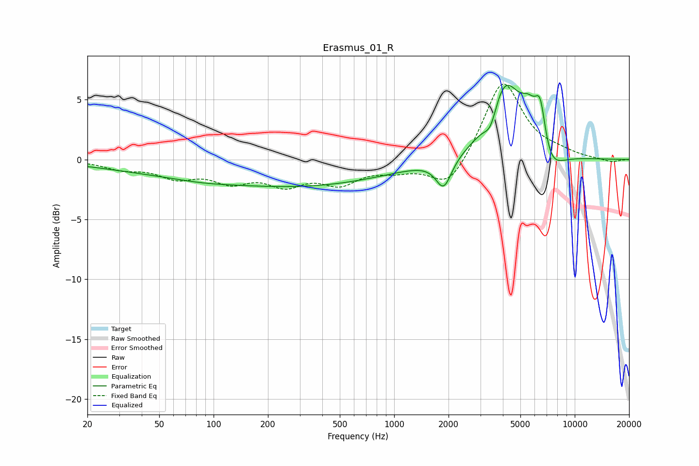

# Erasmus_01_R
See [usage instructions](https://github.com/jaakkopasanen/AutoEq#usage) for more options and info.

### Parametric EQs
Apply preamp of -6.3 dB when using parametric equalizer.

|   # | Type    |   Fc (Hz) |    Q |   Gain (dB) |
|-----|---------|-----------|------|-------------|
|   1 | Peaking |        50 | 0.41 |        -0.8 |
|   2 | Peaking |        87 | 0.88 |        -0.2 |
|   3 | Peaking |       314 | 0.3  |        -2.1 |
|   4 | Peaking |       589 | 0.41 |        -0   |
|   5 | Peaking |      1881 | 3.27 |        -2.5 |
|   6 | Peaking |      3426 | 3.82 |        -1.8 |
|   7 | Peaking |      4078 | 1.51 |         6.5 |
|   8 | Peaking |      5580 | 2.85 |         2.4 |
|   9 | Peaking |      6450 | 4.35 |         4.1 |
|  10 | Peaking |      7074 | 1.86 |        -2.5 |

### Fixed Band EQs
When using fixed band (also called graphic) equalizer, apply preamp of **-6.4 dB** (if available) and set gains manually with these parameters.

|   # | Type    |   Fc (Hz) |    Q |   Gain (dB) |
|-----|---------|-----------|------|-------------|
|   1 | Peaking |        31 | 1.41 |        -0.7 |
|   2 | Peaking |        62 | 1.41 |        -1.3 |
|   3 | Peaking |       125 | 1.41 |        -1.6 |
|   4 | Peaking |       250 | 1.41 |        -1.8 |
|   5 | Peaking |       500 | 1.41 |        -1.8 |
|   6 | Peaking |      1000 | 1.41 |        -0.7 |
|   7 | Peaking |      2000 | 1.41 |        -2.5 |
|   8 | Peaking |      4000 | 1.41 |         6.7 |
|   9 | Peaking |      8000 | 1.41 |         0.4 |
|  10 | Peaking |     16000 | 1.41 |        -0.3 |

### Graphs

