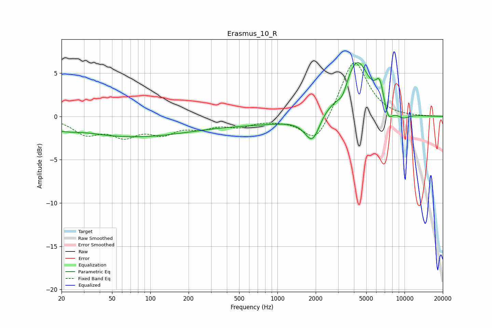

# Erasmus_10_R
See [usage instructions](https://github.com/jaakkopasanen/AutoEq#usage) for more options and info.

### Parametric EQs
Apply preamp of -6.3 dB when using parametric equalizer.

|   # | Type    |   Fc (Hz) |    Q |   Gain (dB) |
|-----|---------|-----------|------|-------------|
|   1 | Peaking |        32 | 1.29 |         0.3 |
|   2 | Peaking |        43 | 0.25 |        -2.1 |
|   3 | Peaking |       389 | 0.21 |        -1   |
|   4 | Peaking |      1891 | 2.36 |        -3.3 |
|   5 | Peaking |      2299 | 1.7  |         0.7 |
|   6 | Peaking |      3247 | 4.01 |        -1.1 |
|   7 | Peaking |      4228 | 1.45 |         6.5 |
|   8 | Peaking |      6372 | 4.26 |         2.6 |
|   9 | Peaking |      7447 | 4    |        -1.8 |
|  10 | Peaking |      9735 | 2.47 |        -0.6 |

### Fixed Band EQs
When using fixed band (also called graphic) equalizer, apply preamp of **-6.3 dB** (if available) and set gains manually with these parameters.

|   # | Type    |   Fc (Hz) |    Q |   Gain (dB) |
|-----|---------|-----------|------|-------------|
|   1 | Peaking |        31 | 1.41 |        -1.9 |
|   2 | Peaking |        62 | 1.41 |        -2   |
|   3 | Peaking |       125 | 1.41 |        -1.7 |
|   4 | Peaking |       250 | 1.41 |        -1.1 |
|   5 | Peaking |       500 | 1.41 |        -1   |
|   6 | Peaking |      1000 | 1.41 |        -0.2 |
|   7 | Peaking |      2000 | 1.41 |        -3.3 |
|   8 | Peaking |      4000 | 1.41 |         6.8 |
|   9 | Peaking |      8000 | 1.41 |        -0.1 |
|  10 | Peaking |     16000 | 1.41 |         0   |

### Graphs

