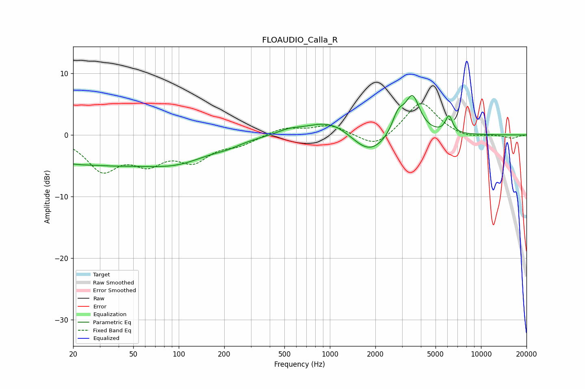

# FLOAUDIO_Calla_R
See [usage instructions](https://github.com/jaakkopasanen/AutoEq#usage) for more options and info.

### Parametric EQs
Apply preamp of -6.5 dB when using parametric equalizer.

|   # | Type    |   Fc (Hz) |    Q |   Gain (dB) |
|-----|---------|-----------|------|-------------|
|   1 | Peaking |        24 | 0.32 |        -4.5 |
|   2 | Peaking |        28 | 2.04 |         0.1 |
|   3 | Peaking |       101 | 0.63 |        -3   |
|   4 | Peaking |       210 | 1.74 |        -0.5 |
|   5 | Peaking |       535 | 1.77 |         0.7 |
|   6 | Peaking |      1010 | 0.93 |         2.6 |
|   7 | Peaking |      1818 | 1.19 |        -3.7 |
|   8 | Peaking |      2825 | 3.52 |         3.1 |
|   9 | Peaking |      3523 | 2.85 |         6.2 |
|  10 | Peaking |      6141 | 6    |         2.8 |

### Fixed Band EQs
When using fixed band (also called graphic) equalizer, apply preamp of **-5.2 dB** (if available) and set gains manually with these parameters.

|   # | Type    |   Fc (Hz) |    Q |   Gain (dB) |
|-----|---------|-----------|------|-------------|
|   1 | Peaking |        31 | 1.41 |        -5.3 |
|   2 | Peaking |        62 | 1.41 |        -3.8 |
|   3 | Peaking |       125 | 1.41 |        -3.7 |
|   4 | Peaking |       250 | 1.41 |        -1.3 |
|   5 | Peaking |       500 | 1.41 |         1.2 |
|   6 | Peaking |      1000 | 1.41 |         1.6 |
|   7 | Peaking |      2000 | 1.41 |        -2.3 |
|   8 | Peaking |      4000 | 1.41 |         5.5 |
|   9 | Peaking |      8000 | 1.41 |        -0.6 |
|  10 | Peaking |     16000 | 1.41 |        -0.5 |

### Graphs

