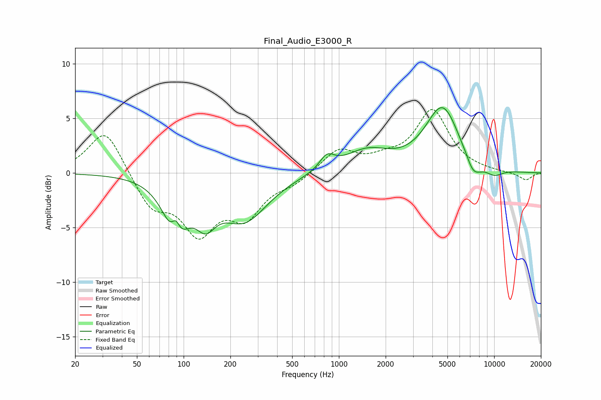

# Final_Audio_E3000_R
See [usage instructions](https://github.com/jaakkopasanen/AutoEq#usage) for more options and info.

### Parametric EQs
Apply preamp of -6.1 dB when using parametric equalizer.

|   # | Type    |   Fc (Hz) |    Q |   Gain (dB) |
|-----|---------|-----------|------|-------------|
|   1 | Peaking |        89 | 1.95 |        -5.2 |
|   2 | Peaking |        89 | 4.99 |         2   |
|   3 | Peaking |       139 | 2.18 |        -2.6 |
|   4 | Peaking |       246 | 0.94 |        -4.1 |
|   5 | Peaking |       838 | 2.93 |         1.3 |
|   6 | Peaking |      1513 | 0.98 |         1.9 |
|   7 | Peaking |      4653 | 1.26 |         6   |
|   8 | Peaking |      6602 | 6    |         0.1 |
|   9 | Peaking |      7296 | 2.5  |        -1.8 |
|  10 | Peaking |     10000 | 2.18 |        -0.7 |

### Fixed Band EQs
When using fixed band (also called graphic) equalizer, apply preamp of **-5.9 dB** (if available) and set gains manually with these parameters.

|   # | Type    |   Fc (Hz) |    Q |   Gain (dB) |
|-----|---------|-----------|------|-------------|
|   1 | Peaking |        31 | 1.41 |         4.1 |
|   2 | Peaking |        62 | 1.41 |        -3   |
|   3 | Peaking |       125 | 1.41 |        -5   |
|   4 | Peaking |       250 | 1.41 |        -3.5 |
|   5 | Peaking |       500 | 1.41 |        -0.8 |
|   6 | Peaking |      1000 | 1.41 |         2.1 |
|   7 | Peaking |      2000 | 1.41 |         0.9 |
|   8 | Peaking |      4000 | 1.41 |         5.6 |
|   9 | Peaking |      8000 | 1.41 |         0.1 |
|  10 | Peaking |     16000 | 1.41 |        -0.7 |

### Graphs

