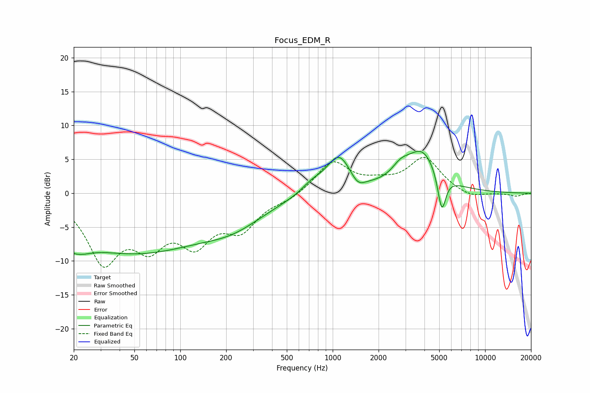

# Focus_EDM_R
See [usage instructions](https://github.com/jaakkopasanen/AutoEq#usage) for more options and info.

### Parametric EQs
Apply preamp of -6.3 dB when using parametric equalizer.

|   # | Type    |   Fc (Hz) |    Q |   Gain (dB) |
|-----|---------|-----------|------|-------------|
|   1 | Peaking |        21 | 2.36 |        -8.1 |
|   2 | Peaking |        21 | 2.79 |         5.5 |
|   3 | Peaking |        50 | 0.28 |        -8.5 |
|   4 | Peaking |       227 | 0.7  |        -2.6 |
|   5 | Peaking |       729 | 2.01 |         1.2 |
|   6 | Peaking |      1097 | 1.73 |         5.4 |
|   7 | Peaking |      1459 | 3.07 |        -1.5 |
|   8 | Peaking |      2791 | 2.42 |         1.7 |
|   9 | Peaking |      3869 | 1.31 |         6   |
|  10 | Peaking |      5197 | 5.2  |        -5.7 |

### Fixed Band EQs
When using fixed band (also called graphic) equalizer, apply preamp of **-5.4 dB** (if available) and set gains manually with these parameters.

|   # | Type    |   Fc (Hz) |    Q |   Gain (dB) |
|-----|---------|-----------|------|-------------|
|   1 | Peaking |        31 | 1.41 |        -9.5 |
|   2 | Peaking |        62 | 1.41 |        -6.1 |
|   3 | Peaking |       125 | 1.41 |        -6.3 |
|   4 | Peaking |       250 | 1.41 |        -4.7 |
|   5 | Peaking |       500 | 1.41 |        -0.8 |
|   6 | Peaking |      1000 | 1.41 |         4.6 |
|   7 | Peaking |      2000 | 1.41 |         1.1 |
|   8 | Peaking |      4000 | 1.41 |         5.1 |
|   9 | Peaking |      8000 | 1.41 |        -0.9 |
|  10 | Peaking |     16000 | 1.41 |        -0.4 |

### Graphs

