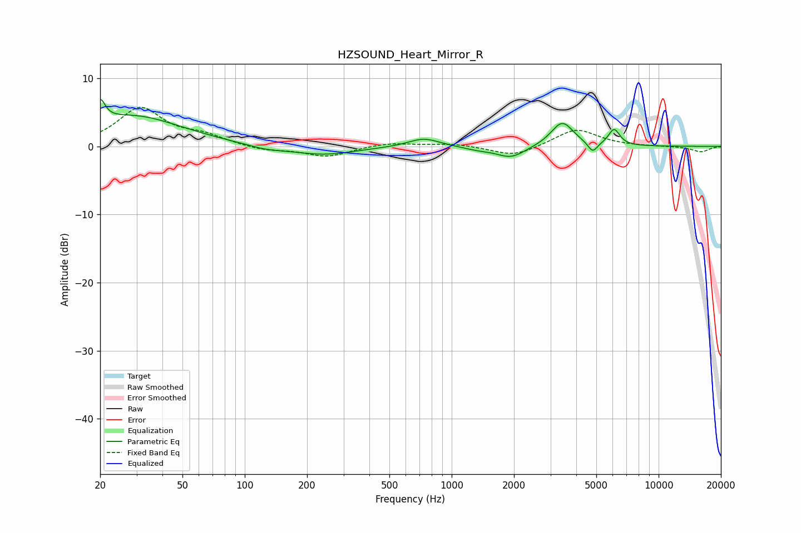

# HZSOUND_Heart_Mirror_R
See [usage instructions](https://github.com/jaakkopasanen/AutoEq#usage) for more options and info.

### Parametric EQs
Apply preamp of -7.0 dB when using parametric equalizer.

|   # | Type    |   Fc (Hz) |    Q |   Gain (dB) |
|-----|---------|-----------|------|-------------|
|   1 | Peaking |        20 | 6    |         3.2 |
|   2 | Peaking |        28 | 0.6  |         4.5 |
|   3 | Peaking |       126 | 1.55 |        -0.6 |
|   4 | Peaking |       240 | 0.92 |        -1.3 |
|   5 | Peaking |       734 | 1.85 |         1.3 |
|   6 | Peaking |      1342 | 1.92 |        -0.4 |
|   7 | Peaking |      1939 | 2.05 |        -1.7 |
|   8 | Peaking |      3423 | 2.61 |         3.6 |
|   9 | Peaking |      4800 | 5.99 |        -1.6 |
|  10 | Peaking |      6094 | 5.1  |         2.4 |

### Fixed Band EQs
When using fixed band (also called graphic) equalizer, apply preamp of **-5.8 dB** (if available) and set gains manually with these parameters.

|   # | Type    |   Fc (Hz) |    Q |   Gain (dB) |
|-----|---------|-----------|------|-------------|
|   1 | Peaking |        31 | 1.41 |         5.5 |
|   2 | Peaking |        62 | 1.41 |         1.3 |
|   3 | Peaking |       125 | 1.41 |        -0.6 |
|   4 | Peaking |       250 | 1.41 |        -1.5 |
|   5 | Peaking |       500 | 1.41 |         0.6 |
|   6 | Peaking |      1000 | 1.41 |         0.4 |
|   7 | Peaking |      2000 | 1.41 |        -1.5 |
|   8 | Peaking |      4000 | 1.41 |         2.6 |
|   9 | Peaking |      8000 | 1.41 |        -0   |
|  10 | Peaking |     16000 | 1.41 |        -0.8 |

### Graphs

