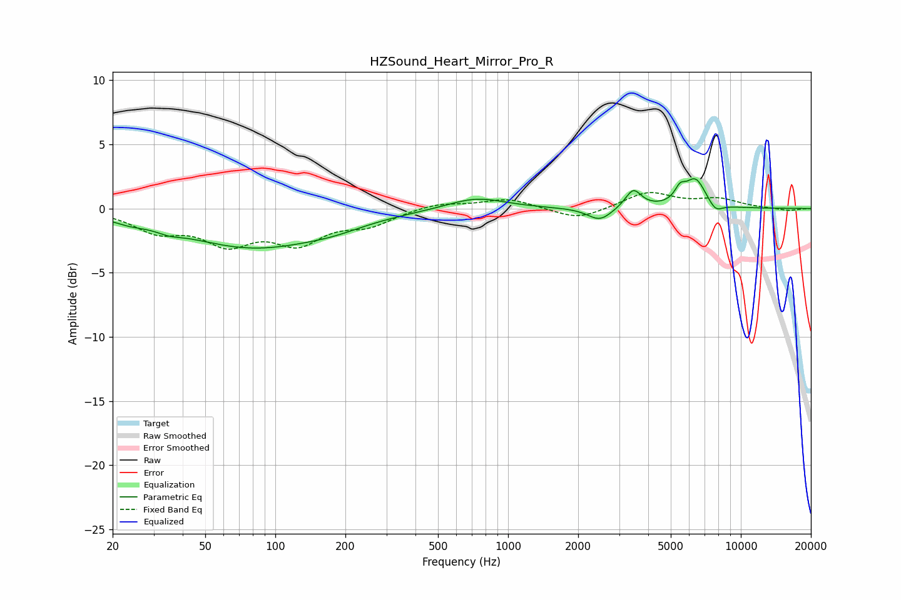

# HZSound_Heart_Mirror_Pro_R
See [usage instructions](https://github.com/jaakkopasanen/AutoEq#usage) for more options and info.

### Parametric EQs
Apply preamp of -2.4 dB when using parametric equalizer.

|   # | Type    |   Fc (Hz) |    Q |   Gain (dB) |
|-----|---------|-----------|------|-------------|
|   1 | Peaking |        24 | 1.9  |        -0.4 |
|   2 | Peaking |        35 | 2.9  |        -0.3 |
|   3 | Peaking |        81 | 0.46 |        -3   |
|   4 | Peaking |       180 | 1.11 |        -0.4 |
|   5 | Peaking |       730 | 1.15 |         0.9 |
|   6 | Peaking |      2478 | 2.72 |        -1   |
|   7 | Peaking |      3451 | 4.11 |         1.5 |
|   8 | Peaking |      5481 | 6    |         0.9 |
|   9 | Peaking |      6383 | 3.03 |         2.2 |
|  10 | Peaking |      7784 | 4.3  |        -0.7 |

### Fixed Band EQs
When using fixed band (also called graphic) equalizer, apply preamp of **-1.3 dB** (if available) and set gains manually with these parameters.

|   # | Type    |   Fc (Hz) |    Q |   Gain (dB) |
|-----|---------|-----------|------|-------------|
|   1 | Peaking |        31 | 1.41 |        -1.6 |
|   2 | Peaking |        62 | 1.41 |        -2.4 |
|   3 | Peaking |       125 | 1.41 |        -2.4 |
|   4 | Peaking |       250 | 1.41 |        -1.1 |
|   5 | Peaking |       500 | 1.41 |         0.5 |
|   6 | Peaking |      1000 | 1.41 |         0.8 |
|   7 | Peaking |      2000 | 1.41 |        -0.9 |
|   8 | Peaking |      4000 | 1.41 |         1.3 |
|   9 | Peaking |      8000 | 1.41 |         0.7 |
|  10 | Peaking |     16000 | 1.41 |        -0.2 |

### Graphs

