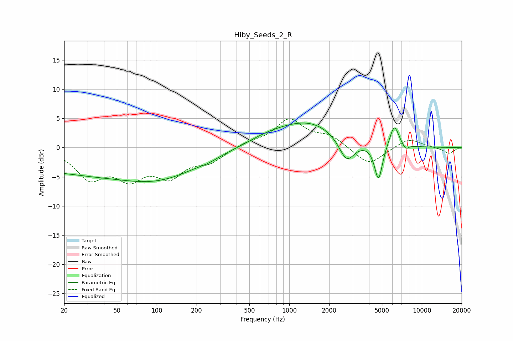

# Hiby_Seeds_2_R
See [usage instructions](https://github.com/jaakkopasanen/AutoEq#usage) for more options and info.

### Parametric EQs
Apply preamp of -4.3 dB when using parametric equalizer.

|   # | Type    |   Fc (Hz) |    Q |   Gain (dB) |
|-----|---------|-----------|------|-------------|
|   1 | Peaking |        24 | 2.6  |         0   |
|   2 | Peaking |        39 | 0.18 |        -4.6 |
|   3 | Peaking |       106 | 0.56 |        -1.8 |
|   4 | Peaking |       247 | 2.39 |        -0.3 |
|   5 | Peaking |       691 | 0.82 |         1.2 |
|   6 | Peaking |      1427 | 0.62 |         4.2 |
|   7 | Peaking |      2713 | 2.37 |        -4.2 |
|   8 | Peaking |      4713 | 4.68 |        -6.2 |
|   9 | Peaking |      6199 | 3.95 |         3.9 |
|  10 | Peaking |      7542 | 5.64 |        -0.9 |

### Fixed Band EQs
When using fixed band (also called graphic) equalizer, apply preamp of **-5.0 dB** (if available) and set gains manually with these parameters.

|   # | Type    |   Fc (Hz) |    Q |   Gain (dB) |
|-----|---------|-----------|------|-------------|
|   1 | Peaking |        31 | 1.41 |        -4.8 |
|   2 | Peaking |        62 | 1.41 |        -4.5 |
|   3 | Peaking |       125 | 1.41 |        -4.4 |
|   4 | Peaking |       250 | 1.41 |        -2.2 |
|   5 | Peaking |       500 | 1.41 |         0.8 |
|   6 | Peaking |      1000 | 1.41 |         4.7 |
|   7 | Peaking |      2000 | 1.41 |         1.8 |
|   8 | Peaking |      4000 | 1.41 |        -3.1 |
|   9 | Peaking |      8000 | 1.41 |         1.6 |
|  10 | Peaking |     16000 | 1.41 |        -1   |

### Graphs

