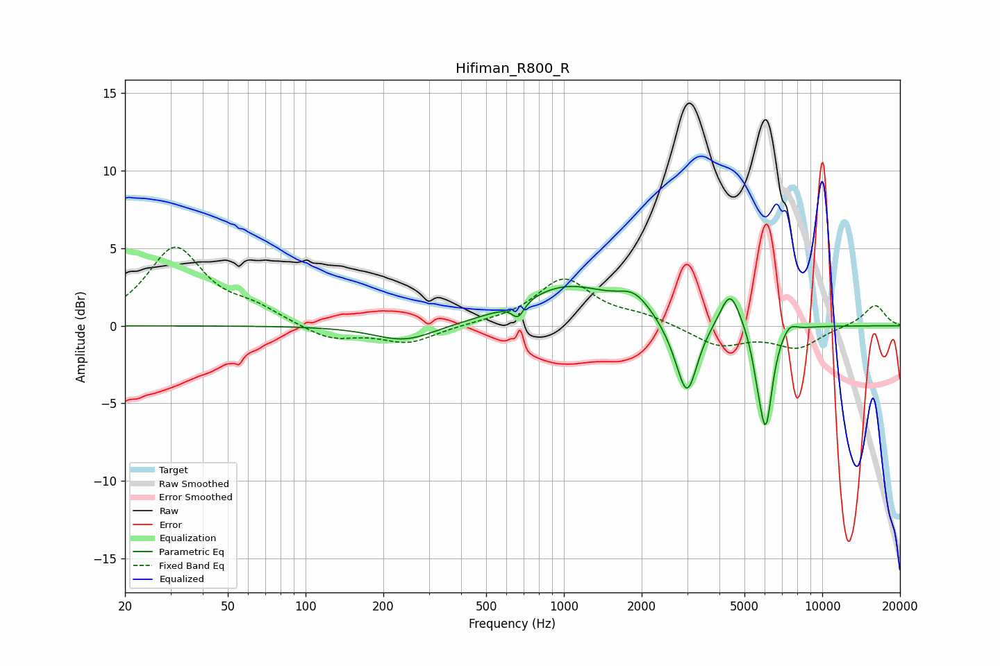

# Hifiman_R800_R
See [usage instructions](https://github.com/jaakkopasanen/AutoEq#usage) for more options and info.

### Parametric EQs
Apply preamp of -2.6 dB when using parametric equalizer.

|   # | Type    |   Fc (Hz) |    Q |   Gain (dB) |
|-----|---------|-----------|------|-------------|
|   1 | Peaking |       242 | 1.19 |        -1.1 |
|   2 | Peaking |       665 | 6    |        -1   |
|   3 | Peaking |      1026 | 0.78 |         2.5 |
|   4 | Peaking |      1875 | 2.16 |         1.3 |
|   5 | Peaking |      2746 | 2.68 |        -0.7 |
|   6 | Peaking |      3004 | 3.58 |        -4.3 |
|   7 | Peaking |      4407 | 3.51 |         2.5 |
|   8 | Peaking |      5617 | 6    |        -1.2 |
|   9 | Peaking |      6046 | 5.33 |        -6.2 |
|  10 | Peaking |      7462 | 4.84 |         0.6 |

### Fixed Band EQs
When using fixed band (also called graphic) equalizer, apply preamp of **-5.2 dB** (if available) and set gains manually with these parameters.

|   # | Type    |   Fc (Hz) |    Q |   Gain (dB) |
|-----|---------|-----------|------|-------------|
|   1 | Peaking |        31 | 1.41 |         4.9 |
|   2 | Peaking |        62 | 1.41 |         0.9 |
|   3 | Peaking |       125 | 1.41 |        -0.9 |
|   4 | Peaking |       250 | 1.41 |        -1.1 |
|   5 | Peaking |       500 | 1.41 |         0.1 |
|   6 | Peaking |      1000 | 1.41 |         3   |
|   7 | Peaking |      2000 | 1.41 |         0.6 |
|   8 | Peaking |      4000 | 1.41 |        -1.3 |
|   9 | Peaking |      8000 | 1.41 |        -1.4 |
|  10 | Peaking |     16000 | 1.41 |         1.4 |

### Graphs

