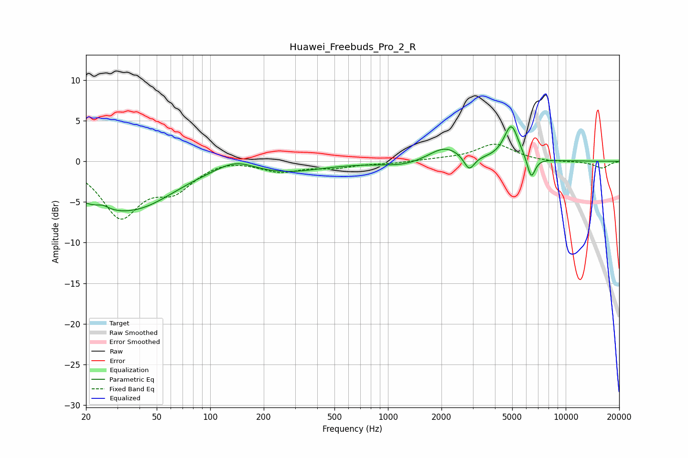

# Huawei_Freebuds_Pro_2_R
See [usage instructions](https://github.com/jaakkopasanen/AutoEq#usage) for more options and info.

### Parametric EQs
Apply preamp of -4.3 dB when using parametric equalizer.

|   # | Type    |   Fc (Hz) |    Q |   Gain (dB) |
|-----|---------|-----------|------|-------------|
|   1 | Peaking |        24 | 0.53 |        -4.3 |
|   2 | Peaking |        25 | 4.4  |         0.5 |
|   3 | Peaking |        43 | 0.69 |        -2.7 |
|   4 | Peaking |       139 | 1.33 |         1.4 |
|   5 | Peaking |       257 | 0.67 |        -1.3 |
|   6 | Peaking |      1246 | 1.1  |        -0.6 |
|   7 | Peaking |      2091 | 1.52 |         1.9 |
|   8 | Peaking |      2864 | 4.83 |        -1.9 |
|   9 | Peaking |      4943 | 3.37 |         4.4 |
|  10 | Peaking |      6398 | 5.99 |        -2.7 |

### Fixed Band EQs
When using fixed band (also called graphic) equalizer, apply preamp of **-2.2 dB** (if available) and set gains manually with these parameters.

|   # | Type    |   Fc (Hz) |    Q |   Gain (dB) |
|-----|---------|-----------|------|-------------|
|   1 | Peaking |        31 | 1.41 |        -6.6 |
|   2 | Peaking |        62 | 1.41 |        -3   |
|   3 | Peaking |       125 | 1.41 |         0.5 |
|   4 | Peaking |       250 | 1.41 |        -1.2 |
|   5 | Peaking |       500 | 1.41 |        -0.7 |
|   6 | Peaking |      1000 | 1.41 |        -0.2 |
|   7 | Peaking |      2000 | 1.41 |         0.2 |
|   8 | Peaking |      4000 | 1.41 |         2.1 |
|   9 | Peaking |      8000 | 1.41 |        -0.1 |
|  10 | Peaking |     16000 | 1.41 |        -0.8 |

### Graphs

