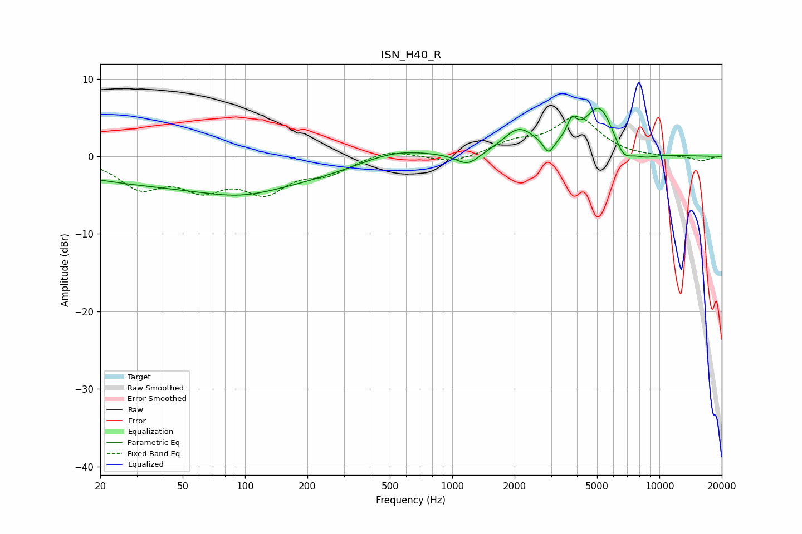

# ISN_H40_R
See [usage instructions](https://github.com/jaakkopasanen/AutoEq#usage) for more options and info.

### Parametric EQs
Apply preamp of -6.3 dB when using parametric equalizer.

|   # | Type    |   Fc (Hz) |    Q |   Gain (dB) |
|-----|---------|-----------|------|-------------|
|   1 | Peaking |        66 | 0.18 |        -3.8 |
|   2 | Peaking |        95 | 0.78 |        -1.3 |
|   3 | Peaking |       521 | 0.81 |         1.6 |
|   4 | Peaking |      1189 | 2.53 |        -1.6 |
|   5 | Peaking |      2096 | 1.82 |         3.3 |
|   6 | Peaking |      2920 | 5.99 |        -1.7 |
|   7 | Peaking |      3777 | 5.95 |         2.4 |
|   8 | Peaking |      5133 | 1.87 |         6.4 |
|   9 | Peaking |      6683 | 3.05 |        -2.3 |
|  10 | Peaking |      8503 | 2.23 |        -0.7 |

### Fixed Band EQs
When using fixed band (also called graphic) equalizer, apply preamp of **-5.3 dB** (if available) and set gains manually with these parameters.

|   # | Type    |   Fc (Hz) |    Q |   Gain (dB) |
|-----|---------|-----------|------|-------------|
|   1 | Peaking |        31 | 1.41 |        -3.7 |
|   2 | Peaking |        62 | 1.41 |        -3.5 |
|   3 | Peaking |       125 | 1.41 |        -4.1 |
|   4 | Peaking |       250 | 1.41 |        -1.9 |
|   5 | Peaking |       500 | 1.41 |         1   |
|   6 | Peaking |      1000 | 1.41 |        -0.9 |
|   7 | Peaking |      2000 | 1.41 |         1.6 |
|   8 | Peaking |      4000 | 1.41 |         4.9 |
|   9 | Peaking |      8000 | 1.41 |        -0.1 |
|  10 | Peaking |     16000 | 1.41 |        -0.6 |

### Graphs

