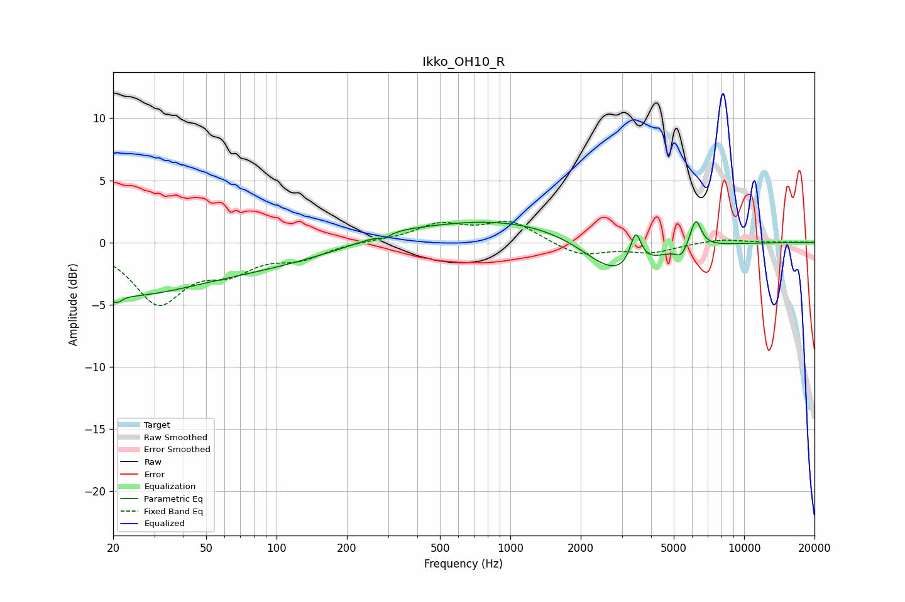

# Ikko_OH10_R
See [usage instructions](https://github.com/jaakkopasanen/AutoEq#usage) for more options and info.

### Parametric EQs
Apply preamp of -1.8 dB when using parametric equalizer.

|   # | Type    |   Fc (Hz) |    Q |   Gain (dB) |
|-----|---------|-----------|------|-------------|
|   1 | Peaking |        21 | 5.87 |        -0.7 |
|   2 | Peaking |        22 | 0.47 |        -3.8 |
|   3 | Peaking |        87 | 0.45 |        -1.5 |
|   4 | Peaking |       290 | 5.98 |        -0.3 |
|   5 | Peaking |       306 | 1.15 |         0.4 |
|   6 | Peaking |       963 | 0.34 |         2   |
|   7 | Peaking |      2867 | 0.97 |        -3.3 |
|   8 | Peaking |      3437 | 5.97 |         2.7 |
|   9 | Peaking |      5376 | 6    |        -0.8 |
|  10 | Peaking |      6212 | 5.85 |         2.3 |

### Fixed Band EQs
When using fixed band (also called graphic) equalizer, apply preamp of **-1.8 dB** (if available) and set gains manually with these parameters.

|   # | Type    |   Fc (Hz) |    Q |   Gain (dB) |
|-----|---------|-----------|------|-------------|
|   1 | Peaking |        31 | 1.41 |        -4.7 |
|   2 | Peaking |        62 | 1.41 |        -1.9 |
|   3 | Peaking |       125 | 1.41 |        -1.1 |
|   4 | Peaking |       250 | 1.41 |         0.1 |
|   5 | Peaking |       500 | 1.41 |         1.4 |
|   6 | Peaking |      1000 | 1.41 |         1.6 |
|   7 | Peaking |      2000 | 1.41 |        -1.1 |
|   8 | Peaking |      4000 | 1.41 |        -0.8 |
|   9 | Peaking |      8000 | 1.41 |         0.3 |
|  10 | Peaking |     16000 | 1.41 |         0   |

### Graphs

