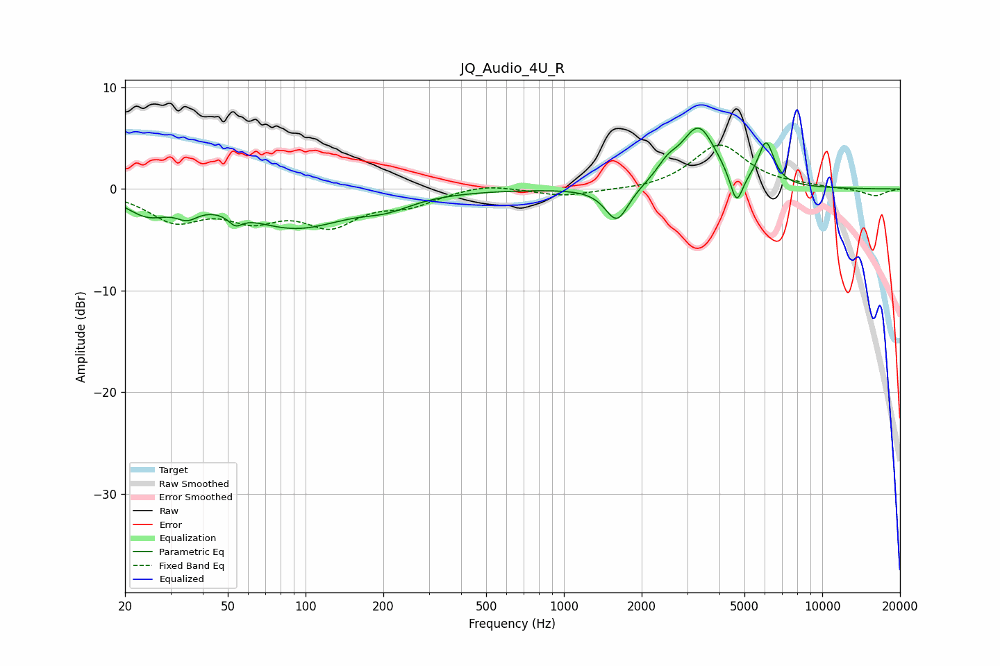

# JQ_Audio_4U_R
See [usage instructions](https://github.com/jaakkopasanen/AutoEq#usage) for more options and info.

### Parametric EQs
Apply preamp of -6.1 dB when using parametric equalizer.

|   # | Type    |   Fc (Hz) |    Q |   Gain (dB) |
|-----|---------|-----------|------|-------------|
|   1 | Peaking |        24 | 1.73 |        -2.1 |
|   2 | Peaking |        35 | 3.31 |        -1.2 |
|   3 | Peaking |        54 | 5.32 |        -1   |
|   4 | Peaking |        91 | 0.72 |        -3.6 |
|   5 | Peaking |       206 | 1.44 |        -1   |
|   6 | Peaking |      1604 | 3.13 |        -3.5 |
|   7 | Peaking |      2514 | 3.48 |         1.3 |
|   8 | Peaking |      3324 | 2.04 |         6   |
|   9 | Peaking |      4658 | 5.68 |        -3.3 |
|  10 | Peaking |      6062 | 4.61 |         4.1 |

### Fixed Band EQs
When using fixed band (also called graphic) equalizer, apply preamp of **-4.4 dB** (if available) and set gains manually with these parameters.

|   # | Type    |   Fc (Hz) |    Q |   Gain (dB) |
|-----|---------|-----------|------|-------------|
|   1 | Peaking |        31 | 1.41 |        -2.9 |
|   2 | Peaking |        62 | 1.41 |        -2.5 |
|   3 | Peaking |       125 | 1.41 |        -3.2 |
|   4 | Peaking |       250 | 1.41 |        -1.4 |
|   5 | Peaking |       500 | 1.41 |         0.6 |
|   6 | Peaking |      1000 | 1.41 |        -0.7 |
|   7 | Peaking |      2000 | 1.41 |        -0.2 |
|   8 | Peaking |      4000 | 1.41 |         4.4 |
|   9 | Peaking |      8000 | 1.41 |         0.2 |
|  10 | Peaking |     16000 | 1.41 |        -0.7 |

### Graphs

