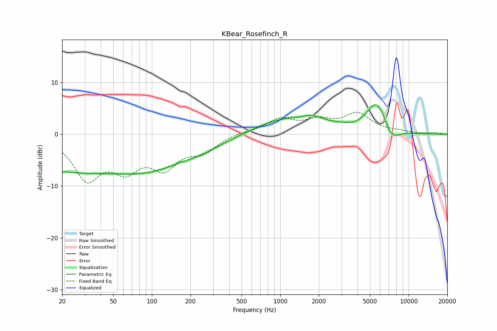

# KBear_Rosefinch_R
See [usage instructions](https://github.com/jaakkopasanen/AutoEq#usage) for more options and info.

### Parametric EQs
Apply preamp of -5.8 dB when using parametric equalizer.

|   # | Type    |   Fc (Hz) |    Q |   Gain (dB) |
|-----|---------|-----------|------|-------------|
|   1 | Peaking |        21 | 0.32 |        -7.1 |
|   2 | Peaking |        21 | 0.33 |         0.6 |
|   3 | Peaking |        99 | 0.54 |        -4.7 |
|   4 | Peaking |       242 | 0.81 |        -1.6 |
|   5 | Peaking |       824 | 0.82 |         1.5 |
|   6 | Peaking |      1423 | 2.57 |        -0.8 |
|   7 | Peaking |      1576 | 0.96 |         3.4 |
|   8 | Peaking |      2913 | 1.93 |         0.3 |
|   9 | Peaking |      5643 | 1.79 |         6.2 |
|  10 | Peaking |      7403 | 2.15 |        -2.7 |

### Fixed Band EQs
When using fixed band (also called graphic) equalizer, apply preamp of **-4.3 dB** (if available) and set gains manually with these parameters.

|   # | Type    |   Fc (Hz) |    Q |   Gain (dB) |
|-----|---------|-----------|------|-------------|
|   1 | Peaking |        31 | 1.41 |        -8.1 |
|   2 | Peaking |        62 | 1.41 |        -5.6 |
|   3 | Peaking |       125 | 1.41 |        -5.6 |
|   4 | Peaking |       250 | 1.41 |        -2.9 |
|   5 | Peaking |       500 | 1.41 |         0.4 |
|   6 | Peaking |      1000 | 1.41 |         2.7 |
|   7 | Peaking |      2000 | 1.41 |         2.2 |
|   8 | Peaking |      4000 | 1.41 |         3.7 |
|   9 | Peaking |      8000 | 1.41 |         0.4 |
|  10 | Peaking |     16000 | 1.41 |         0.2 |

### Graphs

