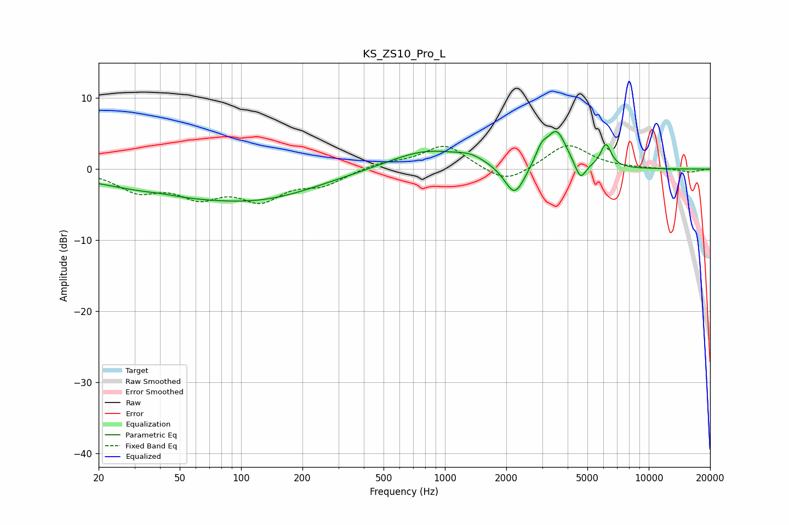

# KS_ZS10_Pro_L
See [usage instructions](https://github.com/jaakkopasanen/AutoEq#usage) for more options and info.

### Parametric EQs
Apply preamp of -5.4 dB when using parametric equalizer.

|   # | Type    |   Fc (Hz) |    Q |   Gain (dB) |
|-----|---------|-----------|------|-------------|
|   1 | Peaking |        41 | 2.23 |         0.2 |
|   2 | Peaking |        69 | 0.3  |        -3.8 |
|   3 | Peaking |       140 | 0.61 |        -1.1 |
|   4 | Peaking |       813 | 0.76 |         2.8 |
|   5 | Peaking |      1342 | 2.11 |         0.9 |
|   6 | Peaking |      2199 | 2.85 |        -4.5 |
|   7 | Peaking |      2977 | 4.77 |         2   |
|   8 | Peaking |      3529 | 2.91 |         5.2 |
|   9 | Peaking |      4624 | 5.25 |        -2.6 |
|  10 | Peaking |      6166 | 5.35 |         3.3 |

### Fixed Band EQs
When using fixed band (also called graphic) equalizer, apply preamp of **-3.4 dB** (if available) and set gains manually with these parameters.

|   # | Type    |   Fc (Hz) |    Q |   Gain (dB) |
|-----|---------|-----------|------|-------------|
|   1 | Peaking |        31 | 1.41 |        -2.8 |
|   2 | Peaking |        62 | 1.41 |        -3.3 |
|   3 | Peaking |       125 | 1.41 |        -3.8 |
|   4 | Peaking |       250 | 1.41 |        -1.9 |
|   5 | Peaking |       500 | 1.41 |         0.9 |
|   6 | Peaking |      1000 | 1.41 |         3.4 |
|   7 | Peaking |      2000 | 1.41 |        -2.3 |
|   8 | Peaking |      4000 | 1.41 |         3.5 |
|   9 | Peaking |      8000 | 1.41 |         0.1 |
|  10 | Peaking |     16000 | 1.41 |        -0.5 |

### Graphs

