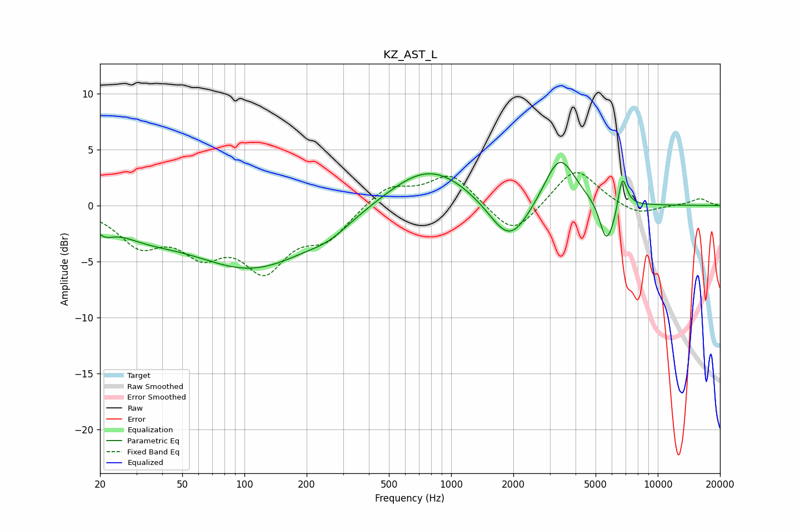

# KZ_AST_L
See [usage instructions](https://github.com/jaakkopasanen/AutoEq#usage) for more options and info.

### Parametric EQs
Apply preamp of -3.9 dB when using parametric equalizer.

|   # | Type    |   Fc (Hz) |    Q |   Gain (dB) |
|-----|---------|-----------|------|-------------|
|   1 | Peaking |        21 | 3.35 |        -1   |
|   2 | Peaking |        32 | 0.84 |        -1.5 |
|   3 | Peaking |       110 | 0.46 |        -5.4 |
|   4 | Peaking |       258 | 1.47 |        -0.8 |
|   5 | Peaking |       780 | 0.71 |         3.7 |
|   6 | Peaking |      1919 | 1.43 |        -4.2 |
|   7 | Peaking |      3349 | 1.86 |         4.6 |
|   8 | Peaking |      5583 | 4.6  |        -3   |
|   9 | Peaking |      6076 | 4.3  |        -1.5 |
|  10 | Peaking |      6729 | 6    |         3.1 |

### Fixed Band EQs
When using fixed band (also called graphic) equalizer, apply preamp of **-3.0 dB** (if available) and set gains manually with these parameters.

|   # | Type    |   Fc (Hz) |    Q |   Gain (dB) |
|-----|---------|-----------|------|-------------|
|   1 | Peaking |        31 | 1.41 |        -3.1 |
|   2 | Peaking |        62 | 1.41 |        -3.5 |
|   3 | Peaking |       125 | 1.41 |        -5.1 |
|   4 | Peaking |       250 | 1.41 |        -2.6 |
|   5 | Peaking |       500 | 1.41 |         1.8 |
|   6 | Peaking |      1000 | 1.41 |         2.8 |
|   7 | Peaking |      2000 | 1.41 |        -2.9 |
|   8 | Peaking |      4000 | 1.41 |         3.5 |
|   9 | Peaking |      8000 | 1.41 |        -0.9 |
|  10 | Peaking |     16000 | 1.41 |         0.6 |

### Graphs

