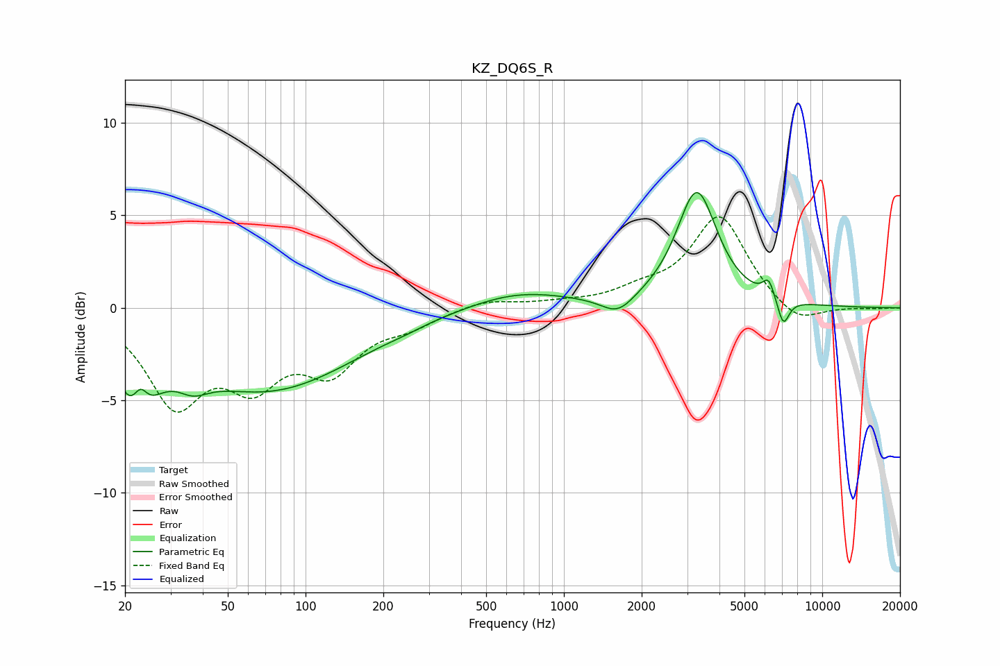

# KZ_DQ6S_R
See [usage instructions](https://github.com/jaakkopasanen/AutoEq#usage) for more options and info.

### Parametric EQs
Apply preamp of -6.3 dB when using parametric equalizer.

|   # | Type    |   Fc (Hz) |    Q |   Gain (dB) |
|-----|---------|-----------|------|-------------|
|   1 | Peaking |        22 | 2.09 |        -4.4 |
|   2 | Peaking |        23 | 4.71 |         1.9 |
|   3 | Peaking |        37 | 2.38 |        -0.9 |
|   4 | Peaking |        71 | 0.42 |        -4.4 |
|   5 | Peaking |       238 | 2.22 |        -0.1 |
|   6 | Peaking |       661 | 0.71 |         0.9 |
|   7 | Peaking |      1617 | 2.21 |        -1   |
|   8 | Peaking |      3267 | 1.82 |         6.2 |
|   9 | Peaking |      6204 | 6    |         1   |
|  10 | Peaking |      7068 | 5.93 |        -1.5 |

### Fixed Band EQs
When using fixed band (also called graphic) equalizer, apply preamp of **-5.0 dB** (if available) and set gains manually with these parameters.

|   # | Type    |   Fc (Hz) |    Q |   Gain (dB) |
|-----|---------|-----------|------|-------------|
|   1 | Peaking |        31 | 1.41 |        -4.9 |
|   2 | Peaking |        62 | 1.41 |        -3.4 |
|   3 | Peaking |       125 | 1.41 |        -3   |
|   4 | Peaking |       250 | 1.41 |        -0.8 |
|   5 | Peaking |       500 | 1.41 |         0.5 |
|   6 | Peaking |      1000 | 1.41 |         0.2 |
|   7 | Peaking |      2000 | 1.41 |         0.7 |
|   8 | Peaking |      4000 | 1.41 |         4.9 |
|   9 | Peaking |      8000 | 1.41 |        -1.1 |
|  10 | Peaking |     16000 | 1.41 |        -0   |

### Graphs

