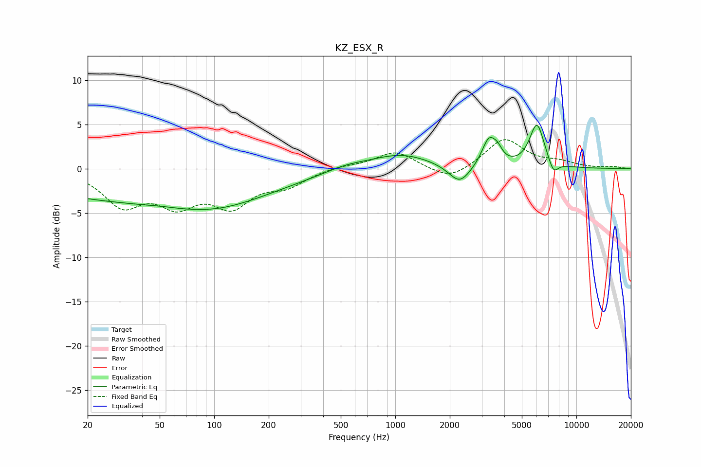

# KZ_ESX_R
See [usage instructions](https://github.com/jaakkopasanen/AutoEq#usage) for more options and info.

### Parametric EQs
Apply preamp of -5.0 dB when using parametric equalizer.

|   # | Type    |   Fc (Hz) |    Q |   Gain (dB) |
|-----|---------|-----------|------|-------------|
|   1 | Peaking |        46 | 0.18 |        -3.7 |
|   2 | Peaking |        51 | 2.66 |         0.1 |
|   3 | Peaking |       102 | 0.62 |        -1.2 |
|   4 | Peaking |       531 | 1.18 |         0.6 |
|   5 | Peaking |      1072 | 0.84 |         1.7 |
|   6 | Peaking |      2266 | 2.37 |        -2.2 |
|   7 | Peaking |      3292 | 3.6  |         3.1 |
|   8 | Peaking |      3679 | 5.47 |         1   |
|   9 | Peaking |      6055 | 3.34 |         5   |
|  10 | Peaking |      7471 | 5.06 |        -1.5 |

### Fixed Band EQs
When using fixed band (also called graphic) equalizer, apply preamp of **-3.4 dB** (if available) and set gains manually with these parameters.

|   # | Type    |   Fc (Hz) |    Q |   Gain (dB) |
|-----|---------|-----------|------|-------------|
|   1 | Peaking |        31 | 1.41 |        -3.9 |
|   2 | Peaking |        62 | 1.41 |        -3.4 |
|   3 | Peaking |       125 | 1.41 |        -3.7 |
|   4 | Peaking |       250 | 1.41 |        -1.7 |
|   5 | Peaking |       500 | 1.41 |         0.3 |
|   6 | Peaking |      1000 | 1.41 |         2   |
|   7 | Peaking |      2000 | 1.41 |        -1.5 |
|   8 | Peaking |      4000 | 1.41 |         3.4 |
|   9 | Peaking |      8000 | 1.41 |         0.6 |
|  10 | Peaking |     16000 | 1.41 |         0.2 |

### Graphs

