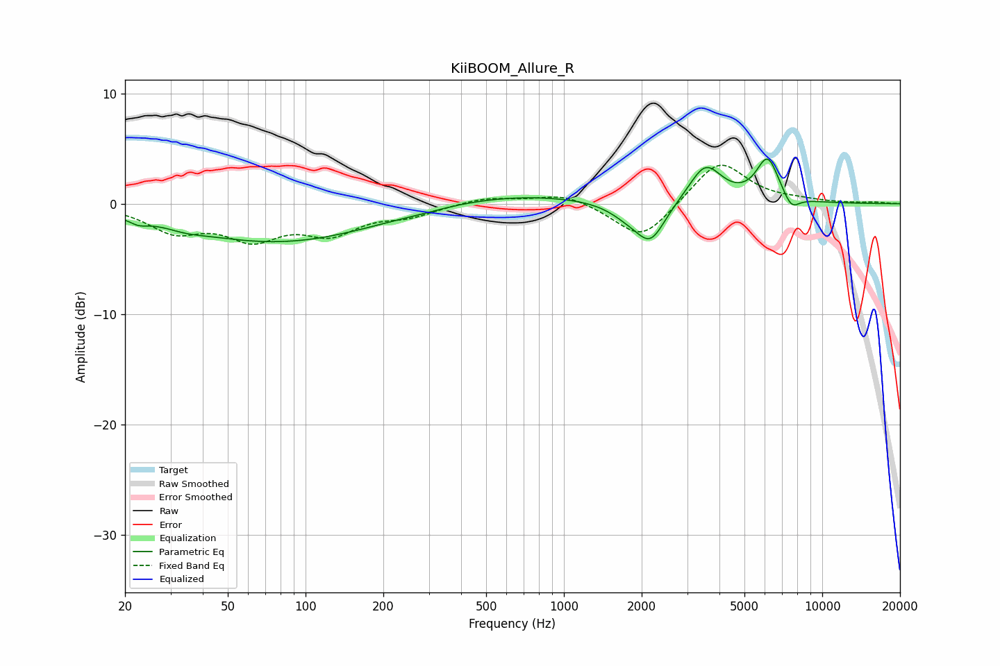

# KiiBOOM_Allure_R
See [usage instructions](https://github.com/jaakkopasanen/AutoEq#usage) for more options and info.

### Parametric EQs
Apply preamp of -4.1 dB when using parametric equalizer.

|   # | Type    |   Fc (Hz) |    Q |   Gain (dB) |
|-----|---------|-----------|------|-------------|
|   1 | Peaking |        23 | 4.23 |        -0.5 |
|   2 | Peaking |        35 | 2.05 |        -0.3 |
|   3 | Peaking |        78 | 0.37 |        -3.5 |
|   4 | Peaking |       283 | 1.65 |        -0.1 |
|   5 | Peaking |       621 | 0.46 |         0.9 |
|   6 | Peaking |      1764 | 1.94 |        -1   |
|   7 | Peaking |      2166 | 2.47 |        -3.4 |
|   8 | Peaking |      3533 | 2.21 |         3.5 |
|   9 | Peaking |      6146 | 3.11 |         3.9 |
|  10 | Peaking |      7590 | 4.26 |        -1.3 |

### Fixed Band EQs
When using fixed band (also called graphic) equalizer, apply preamp of **-3.6 dB** (if available) and set gains manually with these parameters.

|   # | Type    |   Fc (Hz) |    Q |   Gain (dB) |
|-----|---------|-----------|------|-------------|
|   1 | Peaking |        31 | 1.41 |        -2.3 |
|   2 | Peaking |        62 | 1.41 |        -2.8 |
|   3 | Peaking |       125 | 1.41 |        -2.4 |
|   4 | Peaking |       250 | 1.41 |        -0.9 |
|   5 | Peaking |       500 | 1.41 |         0.6 |
|   6 | Peaking |      1000 | 1.41 |         1   |
|   7 | Peaking |      2000 | 1.41 |        -3.4 |
|   8 | Peaking |      4000 | 1.41 |         4   |
|   9 | Peaking |      8000 | 1.41 |         0.2 |
|  10 | Peaking |     16000 | 1.41 |         0.1 |

### Graphs

