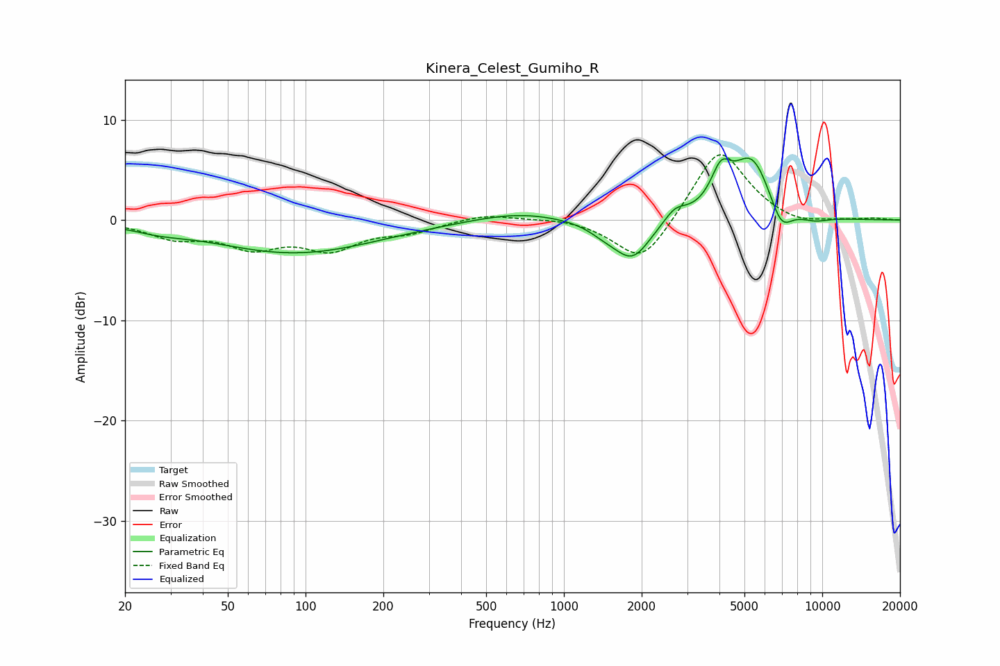

# Kinera_Celest_Gumiho_R
See [usage instructions](https://github.com/jaakkopasanen/AutoEq#usage) for more options and info.

### Parametric EQs
Apply preamp of -6.3 dB when using parametric equalizer.

|   # | Type    |   Fc (Hz) |    Q |   Gain (dB) |
|-----|---------|-----------|------|-------------|
|   1 | Peaking |        27 | 1.52 |        -0.5 |
|   2 | Peaking |        91 | 0.44 |        -3.3 |
|   3 | Peaking |       667 | 0.81 |         0.9 |
|   4 | Peaking |      1433 | 2.31 |        -0.8 |
|   5 | Peaking |      1842 | 1.96 |        -3.9 |
|   6 | Peaking |      2692 | 3.28 |         1.3 |
|   7 | Peaking |      4058 | 3.57 |         3.4 |
|   8 | Peaking |      5338 | 1.78 |         6.2 |
|   9 | Peaking |      6932 | 3.11 |        -2.8 |
|  10 | Peaking |      9309 | 2.23 |        -0.6 |

### Fixed Band EQs
When using fixed band (also called graphic) equalizer, apply preamp of **-6.6 dB** (if available) and set gains manually with these parameters.

|   # | Type    |   Fc (Hz) |    Q |   Gain (dB) |
|-----|---------|-----------|------|-------------|
|   1 | Peaking |        31 | 1.41 |        -1.6 |
|   2 | Peaking |        62 | 1.41 |        -2.4 |
|   3 | Peaking |       125 | 1.41 |        -2.6 |
|   4 | Peaking |       250 | 1.41 |        -1   |
|   5 | Peaking |       500 | 1.41 |         0.7 |
|   6 | Peaking |      1000 | 1.41 |         0.3 |
|   7 | Peaking |      2000 | 1.41 |        -4.6 |
|   8 | Peaking |      4000 | 1.41 |         7.4 |
|   9 | Peaking |      8000 | 1.41 |        -0.7 |
|  10 | Peaking |     16000 | 1.41 |         0.2 |

### Graphs

