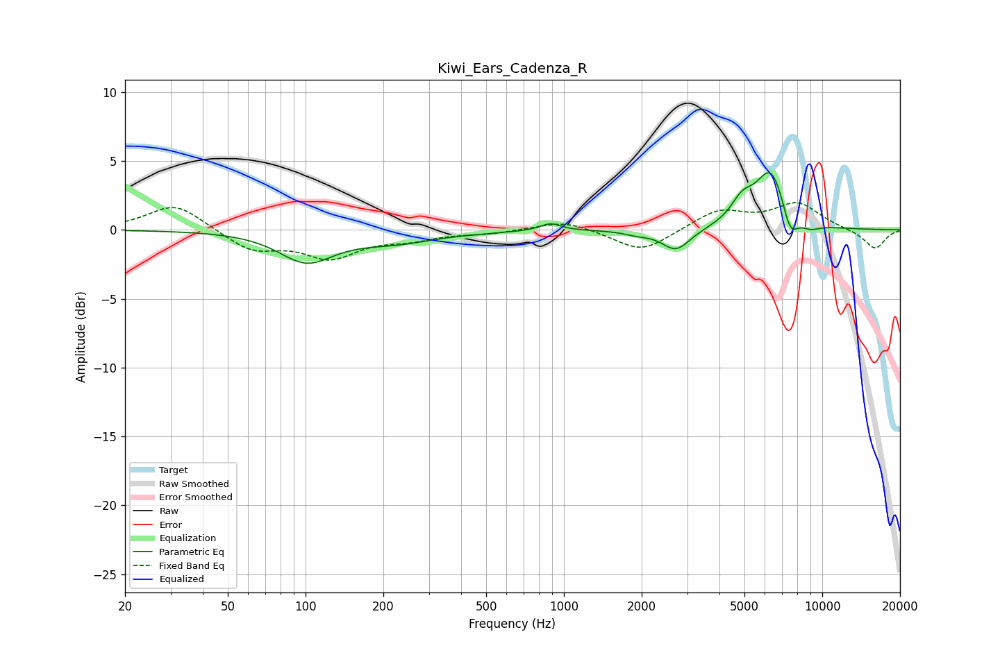

# Kiwi_Ears_Cadenza_R
See [usage instructions](https://github.com/jaakkopasanen/AutoEq#usage) for more options and info.

### Parametric EQs
Apply preamp of -4.2 dB when using parametric equalizer.

|   # | Type    |   Fc (Hz) |    Q |   Gain (dB) |
|-----|---------|-----------|------|-------------|
|   1 | Peaking |       101 | 1.34 |        -2.2 |
|   2 | Peaking |       223 | 0.91 |        -0.8 |
|   3 | Peaking |       477 | 1.52 |        -0.1 |
|   4 | Peaking |       889 | 3.49 |         0.5 |
|   5 | Peaking |      1909 | 2.92 |        -0.2 |
|   6 | Peaking |      2719 | 2.55 |        -1.6 |
|   7 | Peaking |      4898 | 3.11 |         1.5 |
|   8 | Peaking |      6344 | 2.27 |         4.3 |
|   9 | Peaking |      7505 | 4.33 |        -2   |
|  10 | Peaking |      8961 | 3.2  |        -0.5 |

### Fixed Band EQs
When using fixed band (also called graphic) equalizer, apply preamp of **-2.1 dB** (if available) and set gains manually with these parameters.

|   # | Type    |   Fc (Hz) |    Q |   Gain (dB) |
|-----|---------|-----------|------|-------------|
|   1 | Peaking |        31 | 1.41 |         1.9 |
|   2 | Peaking |        62 | 1.41 |        -1.5 |
|   3 | Peaking |       125 | 1.41 |        -1.9 |
|   4 | Peaking |       250 | 1.41 |        -0.6 |
|   5 | Peaking |       500 | 1.41 |        -0.2 |
|   6 | Peaking |      1000 | 1.41 |         0.7 |
|   7 | Peaking |      2000 | 1.41 |        -1.7 |
|   8 | Peaking |      4000 | 1.41 |         1.4 |
|   9 | Peaking |      8000 | 1.41 |         1.9 |
|  10 | Peaking |     16000 | 1.41 |        -1.4 |

### Graphs

