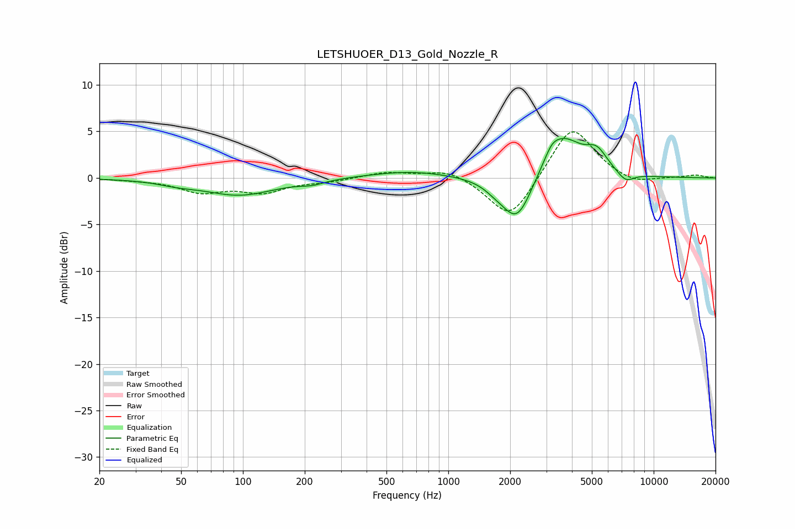

# LETSHUOER_D13_Gold_Nozzle_R
See [usage instructions](https://github.com/jaakkopasanen/AutoEq#usage) for more options and info.

### Parametric EQs
Apply preamp of -4.3 dB when using parametric equalizer.

|   # | Type    |   Fc (Hz) |    Q |   Gain (dB) |
|-----|---------|-----------|------|-------------|
|   1 | Peaking |        48 | 1.6  |        -0.4 |
|   2 | Peaking |        96 | 0.82 |        -1.8 |
|   3 | Peaking |       218 | 2.38 |        -0.4 |
|   4 | Peaking |       649 | 0.72 |         0.7 |
|   5 | Peaking |      1703 | 2.55 |        -0.6 |
|   6 | Peaking |      2162 | 1.91 |        -5.1 |
|   7 | Peaking |      3191 | 4    |         1   |
|   8 | Peaking |      3611 | 1.44 |         4.4 |
|   9 | Peaking |      5284 | 2.66 |         2   |
|  10 | Peaking |      7300 | 3.29 |        -1.1 |

### Fixed Band EQs
When using fixed band (also called graphic) equalizer, apply preamp of **-5.0 dB** (if available) and set gains manually with these parameters.

|   # | Type    |   Fc (Hz) |    Q |   Gain (dB) |
|-----|---------|-----------|------|-------------|
|   1 | Peaking |        31 | 1.41 |        -0.1 |
|   2 | Peaking |        62 | 1.41 |        -1.4 |
|   3 | Peaking |       125 | 1.41 |        -1.4 |
|   4 | Peaking |       250 | 1.41 |        -0.3 |
|   5 | Peaking |       500 | 1.41 |         0.6 |
|   6 | Peaking |      1000 | 1.41 |         1   |
|   7 | Peaking |      2000 | 1.41 |        -4.7 |
|   8 | Peaking |      4000 | 1.41 |         5.8 |
|   9 | Peaking |      8000 | 1.41 |        -0.8 |
|  10 | Peaking |     16000 | 1.41 |         0.3 |

### Graphs

