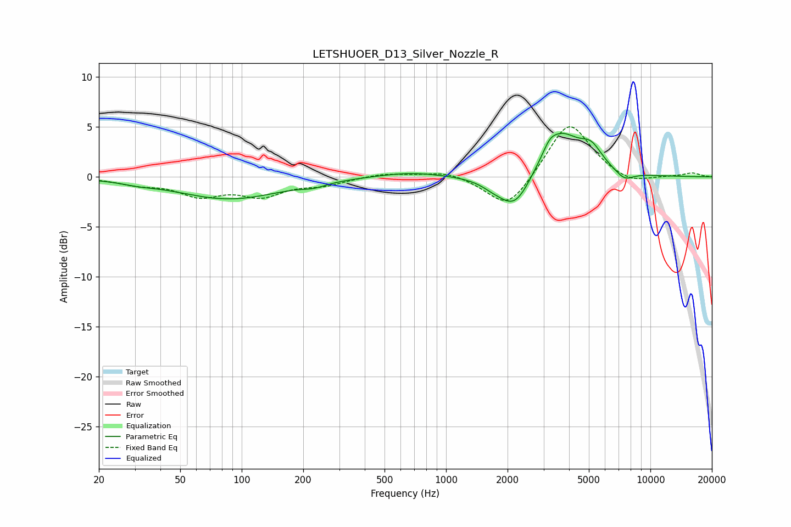

# LETSHUOER_D13_Silver_Nozzle_R
See [usage instructions](https://github.com/jaakkopasanen/AutoEq#usage) for more options and info.

### Parametric EQs
Apply preamp of -4.5 dB when using parametric equalizer.

|   # | Type    |   Fc (Hz) |    Q |   Gain (dB) |
|-----|---------|-----------|------|-------------|
|   1 | Peaking |        31 | 1.93 |        -0.2 |
|   2 | Peaking |        87 | 0.56 |        -2.2 |
|   3 | Peaking |       225 | 2.55 |        -0.4 |
|   4 | Peaking |       665 | 0.89 |         0.5 |
|   5 | Peaking |      1681 | 2.57 |        -0.4 |
|   6 | Peaking |      2168 | 1.74 |        -3.6 |
|   7 | Peaking |      3214 | 4.63 |         0.7 |
|   8 | Peaking |      3611 | 1.43 |         4.4 |
|   9 | Peaking |      5136 | 2.54 |         1.9 |
|  10 | Peaking |      7472 | 2.98 |        -0.9 |

### Fixed Band EQs
When using fixed band (also called graphic) equalizer, apply preamp of **-5.1 dB** (if available) and set gains manually with these parameters.

|   # | Type    |   Fc (Hz) |    Q |   Gain (dB) |
|-----|---------|-----------|------|-------------|
|   1 | Peaking |        31 | 1.41 |        -0.6 |
|   2 | Peaking |        62 | 1.41 |        -1.7 |
|   3 | Peaking |       125 | 1.41 |        -1.7 |
|   4 | Peaking |       250 | 1.41 |        -0.7 |
|   5 | Peaking |       500 | 1.41 |         0.4 |
|   6 | Peaking |      1000 | 1.41 |         0.6 |
|   7 | Peaking |      2000 | 1.41 |        -3.4 |
|   8 | Peaking |      4000 | 1.41 |         5.7 |
|   9 | Peaking |      8000 | 1.41 |        -0.8 |
|  10 | Peaking |     16000 | 1.41 |         0.4 |

### Graphs

