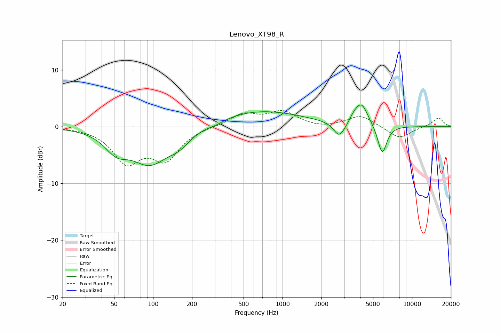

# Lenovo_XT98_R
See [usage instructions](https://github.com/jaakkopasanen/AutoEq#usage) for more options and info.

### Parametric EQs
Apply preamp of -3.9 dB when using parametric equalizer.

|   # | Type    |   Fc (Hz) |    Q |   Gain (dB) |
|-----|---------|-----------|------|-------------|
|   1 | Peaking |        52 | 1.6  |        -3   |
|   2 | Peaking |        94 | 0.98 |        -6   |
|   3 | Peaking |       159 | 1.56 |        -2.1 |
|   4 | Peaking |       303 | 1.96 |        -0.5 |
|   5 | Peaking |       662 | 0.42 |         2.8 |
|   6 | Peaking |      2728 | 3.42 |        -2.4 |
|   7 | Peaking |      3108 | 2.82 |        -0.8 |
|   8 | Peaking |      3550 | 2.7  |         1.5 |
|   9 | Peaking |      4101 | 2.83 |         3.4 |
|  10 | Peaking |      5894 | 3.93 |        -5.2 |

### Fixed Band EQs
When using fixed band (also called graphic) equalizer, apply preamp of **-2.9 dB** (if available) and set gains manually with these parameters.

|   # | Type    |   Fc (Hz) |    Q |   Gain (dB) |
|-----|---------|-----------|------|-------------|
|   1 | Peaking |        31 | 1.41 |        -0.1 |
|   2 | Peaking |        62 | 1.41 |        -5.9 |
|   3 | Peaking |       125 | 1.41 |        -5.3 |
|   4 | Peaking |       250 | 1.41 |         0   |
|   5 | Peaking |       500 | 1.41 |         2.2 |
|   6 | Peaking |      1000 | 1.41 |         2.5 |
|   7 | Peaking |      2000 | 1.41 |        -0.3 |
|   8 | Peaking |      4000 | 1.41 |         2   |
|   9 | Peaking |      8000 | 1.41 |        -2.1 |
|  10 | Peaking |     16000 | 1.41 |         1.6 |

### Graphs

