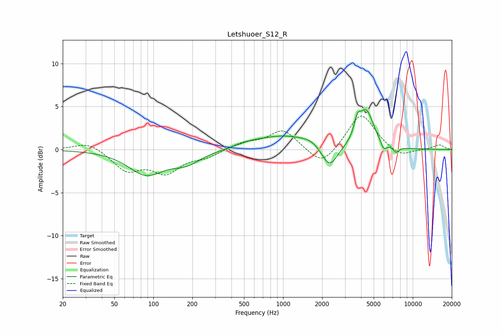

# Letshuoer_S12_R
See [usage instructions](https://github.com/jaakkopasanen/AutoEq#usage) for more options and info.

### Parametric EQs
Apply preamp of -4.7 dB when using parametric equalizer.

|   # | Type    |   Fc (Hz) |    Q |   Gain (dB) |
|-----|---------|-----------|------|-------------|
|   1 | Peaking |        88 | 1.04 |        -2.8 |
|   2 | Peaking |       179 | 1.24 |        -1.3 |
|   3 | Peaking |       546 | 1.45 |         0.4 |
|   4 | Peaking |       989 | 0.71 |         1.5 |
|   5 | Peaking |      1652 | 1.74 |         0.6 |
|   6 | Peaking |      2280 | 2.3  |        -2.7 |
|   7 | Peaking |      3736 | 6    |         1.7 |
|   8 | Peaking |      4369 | 2.4  |         4.4 |
|   9 | Peaking |      5969 | 6    |        -1   |
|  10 | Peaking |      7427 | 6    |        -0.7 |

### Fixed Band EQs
When using fixed band (also called graphic) equalizer, apply preamp of **-4.0 dB** (if available) and set gains manually with these parameters.

|   # | Type    |   Fc (Hz) |    Q |   Gain (dB) |
|-----|---------|-----------|------|-------------|
|   1 | Peaking |        31 | 1.41 |         1   |
|   2 | Peaking |        62 | 1.41 |        -2.3 |
|   3 | Peaking |       125 | 1.41 |        -2.5 |
|   4 | Peaking |       250 | 1.41 |        -0.8 |
|   5 | Peaking |       500 | 1.41 |         0.8 |
|   6 | Peaking |      1000 | 1.41 |         2.3 |
|   7 | Peaking |      2000 | 1.41 |        -2.1 |
|   8 | Peaking |      4000 | 1.41 |         4.3 |
|   9 | Peaking |      8000 | 1.41 |        -1   |
|  10 | Peaking |     16000 | 1.41 |         0.6 |

### Graphs

