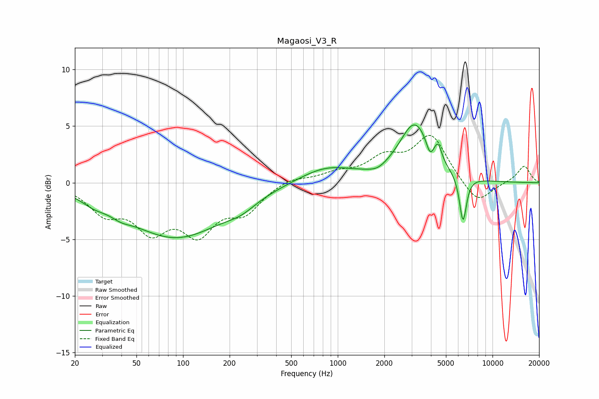

# Magaosi_V3_R
See [usage instructions](https://github.com/jaakkopasanen/AutoEq#usage) for more options and info.

### Parametric EQs
Apply preamp of -5.2 dB when using parametric equalizer.

|   # | Type    |   Fc (Hz) |    Q |   Gain (dB) |
|-----|---------|-----------|------|-------------|
|   1 | Peaking |        27 | 1.81 |        -0.6 |
|   2 | Peaking |        40 | 2.24 |        -0.5 |
|   3 | Peaking |        90 | 0.45 |        -4.8 |
|   4 | Peaking |       237 | 1.45 |        -0.7 |
|   5 | Peaking |       843 | 0.8  |         1.4 |
|   6 | Peaking |      1810 | 2.45 |        -0.4 |
|   7 | Peaking |      3151 | 1.4  |         5.1 |
|   8 | Peaking |      3941 | 6    |        -1.1 |
|   9 | Peaking |      4447 | 6    |         1.4 |
|  10 | Peaking |      6445 | 6    |        -4.1 |

### Fixed Band EQs
When using fixed band (also called graphic) equalizer, apply preamp of **-4.3 dB** (if available) and set gains manually with these parameters.

|   # | Type    |   Fc (Hz) |    Q |   Gain (dB) |
|-----|---------|-----------|------|-------------|
|   1 | Peaking |        31 | 1.41 |        -2.4 |
|   2 | Peaking |        62 | 1.41 |        -3.6 |
|   3 | Peaking |       125 | 1.41 |        -3.9 |
|   4 | Peaking |       250 | 1.41 |        -2.3 |
|   5 | Peaking |       500 | 1.41 |         0.5 |
|   6 | Peaking |      1000 | 1.41 |         0.7 |
|   7 | Peaking |      2000 | 1.41 |         1.9 |
|   8 | Peaking |      4000 | 1.41 |         4.1 |
|   9 | Peaking |      8000 | 1.41 |        -2   |
|  10 | Peaking |     16000 | 1.41 |         1.5 |

### Graphs

