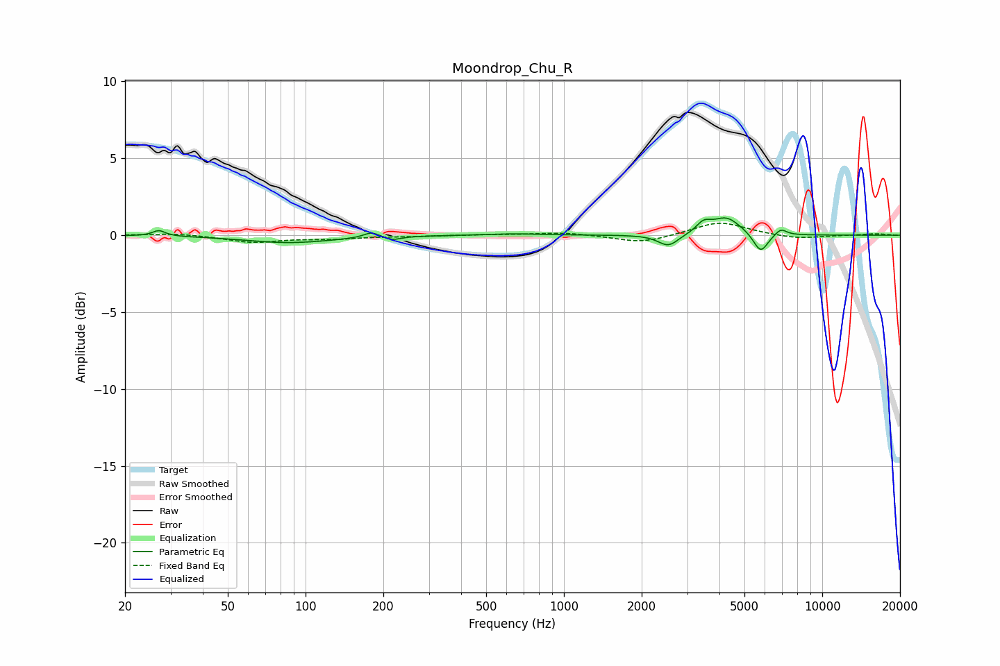

# Moondrop_Chu_R
See [usage instructions](https://github.com/jaakkopasanen/AutoEq#usage) for more options and info.

### Parametric EQs
Apply preamp of -1.2 dB when using parametric equalizer.

|   # | Type    |   Fc (Hz) |    Q |   Gain (dB) |
|-----|---------|-----------|------|-------------|
|   1 | Peaking |        27 | 5.95 |         0.4 |
|   2 | Peaking |        86 | 0.83 |        -0.5 |
|   3 | Peaking |       180 | 4.7  |         0.4 |
|   4 | Peaking |       217 | 4.51 |        -0.2 |
|   5 | Peaking |       640 | 1.36 |         0.1 |
|   6 | Peaking |      2538 | 3.6  |        -0.8 |
|   7 | Peaking |      3474 | 5.1  |         0.6 |
|   8 | Peaking |      4258 | 2.49 |         1.1 |
|   9 | Peaking |      5778 | 4.91 |        -1.3 |
|  10 | Peaking |      6913 | 6    |         0.4 |

### Fixed Band EQs
When using fixed band (also called graphic) equalizer, apply preamp of **-0.9 dB** (if available) and set gains manually with these parameters.

|   # | Type    |   Fc (Hz) |    Q |   Gain (dB) |
|-----|---------|-----------|------|-------------|
|   1 | Peaking |        31 | 1.41 |         0.1 |
|   2 | Peaking |        62 | 1.41 |        -0.4 |
|   3 | Peaking |       125 | 1.41 |        -0.2 |
|   4 | Peaking |       250 | 1.41 |        -0.1 |
|   5 | Peaking |       500 | 1.41 |         0   |
|   6 | Peaking |      1000 | 1.41 |         0.2 |
|   7 | Peaking |      2000 | 1.41 |        -0.5 |
|   8 | Peaking |      4000 | 1.41 |         0.9 |
|   9 | Peaking |      8000 | 1.41 |        -0.3 |
|  10 | Peaking |     16000 | 1.41 |         0.1 |

### Graphs

