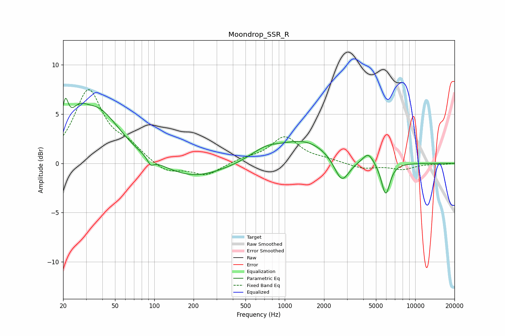

# Moondrop_SSR_R
See [usage instructions](https://github.com/jaakkopasanen/AutoEq#usage) for more options and info.

### Parametric EQs
Apply preamp of -6.7 dB when using parametric equalizer.

|   # | Type    |   Fc (Hz) |    Q |   Gain (dB) |
|-----|---------|-----------|------|-------------|
|   1 | Peaking |        21 | 5.97 |         3.2 |
|   2 | Peaking |        26 | 2.33 |         1.8 |
|   3 | Peaking |        37 | 0.83 |         5.3 |
|   4 | Peaking |        94 | 5.97 |        -0.7 |
|   5 | Peaking |       196 | 0.61 |        -1.6 |
|   6 | Peaking |       713 | 1.2  |         1.1 |
|   7 | Peaking |      1433 | 0.73 |         2.2 |
|   8 | Peaking |      2735 | 2.43 |        -2.6 |
|   9 | Peaking |      4368 | 3.37 |         1.1 |
|  10 | Peaking |      5937 | 4.11 |        -3.3 |

### Fixed Band EQs
When using fixed band (also called graphic) equalizer, apply preamp of **-7.6 dB** (if available) and set gains manually with these parameters.

|   # | Type    |   Fc (Hz) |    Q |   Gain (dB) |
|-----|---------|-----------|------|-------------|
|   1 | Peaking |        31 | 1.41 |         7.3 |
|   2 | Peaking |        62 | 1.41 |         1.4 |
|   3 | Peaking |       125 | 1.41 |        -1   |
|   4 | Peaking |       250 | 1.41 |        -1.2 |
|   5 | Peaking |       500 | 1.41 |         0.4 |
|   6 | Peaking |      1000 | 1.41 |         2.6 |
|   7 | Peaking |      2000 | 1.41 |         0.3 |
|   8 | Peaking |      4000 | 1.41 |        -0.5 |
|   9 | Peaking |      8000 | 1.41 |        -0.6 |
|  10 | Peaking |     16000 | 1.41 |        -0.1 |

### Graphs

