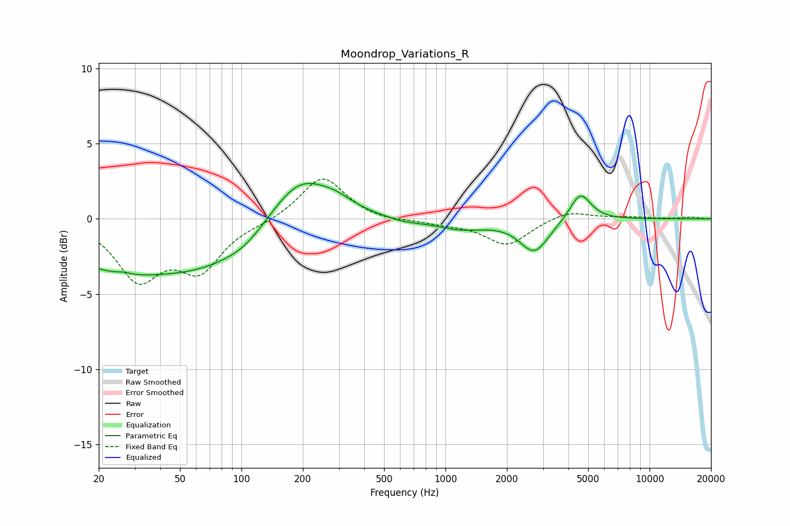

# Moondrop_Variations_R
See [usage instructions](https://github.com/jaakkopasanen/AutoEq#usage) for more options and info.

### Parametric EQs
Apply preamp of -2.5 dB when using parametric equalizer.

|   # | Type    |   Fc (Hz) |    Q |   Gain (dB) |
|-----|---------|-----------|------|-------------|
|   1 | Peaking |        24 | 0.51 |        -3   |
|   2 | Peaking |        26 | 4.06 |         0.2 |
|   3 | Peaking |        68 | 0.63 |        -2.2 |
|   4 | Peaking |       104 | 1.47 |        -0.6 |
|   5 | Peaking |       194 | 0.98 |         3   |
|   6 | Peaking |       293 | 1.75 |         0.5 |
|   7 | Peaking |       622 | 1.8  |        -0.2 |
|   8 | Peaking |      1182 | 1.1  |        -0.7 |
|   9 | Peaking |      2726 | 1.99 |        -2.2 |
|  10 | Peaking |      4579 | 2.72 |         1.9 |

### Fixed Band EQs
When using fixed band (also called graphic) equalizer, apply preamp of **-2.7 dB** (if available) and set gains manually with these parameters.

|   # | Type    |   Fc (Hz) |    Q |   Gain (dB) |
|-----|---------|-----------|------|-------------|
|   1 | Peaking |        31 | 1.41 |        -3.8 |
|   2 | Peaking |        62 | 1.41 |        -3.1 |
|   3 | Peaking |       125 | 1.41 |        -0.2 |
|   4 | Peaking |       250 | 1.41 |         2.9 |
|   5 | Peaking |       500 | 1.41 |        -0.2 |
|   6 | Peaking |      1000 | 1.41 |        -0.3 |
|   7 | Peaking |      2000 | 1.41 |        -1.7 |
|   8 | Peaking |      4000 | 1.41 |         0.6 |
|   9 | Peaking |      8000 | 1.41 |         0.1 |
|  10 | Peaking |     16000 | 1.41 |         0.1 |

### Graphs

