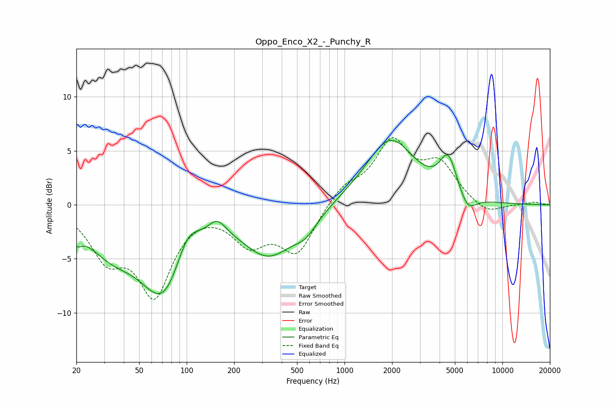

# Oppo_Enco_X2_-_Punchy_R
See [usage instructions](https://github.com/jaakkopasanen/AutoEq#usage) for more options and info.

### Parametric EQs
Apply preamp of -6.1 dB when using parametric equalizer.

|   # | Type    |   Fc (Hz) |    Q |   Gain (dB) |
|-----|---------|-----------|------|-------------|
|   1 | Peaking |        20 | 4.47 |        -1.3 |
|   2 | Peaking |        33 | 0.86 |        -3.2 |
|   3 | Peaking |        72 | 0.94 |        -8   |
|   4 | Peaking |       101 | 1.77 |         3.2 |
|   5 | Peaking |       156 | 2.45 |         1.5 |
|   6 | Peaking |       332 | 0.86 |        -4.4 |
|   7 | Peaking |       568 | 1.82 |        -1.4 |
|   8 | Peaking |      1947 | 0.91 |         6.1 |
|   9 | Peaking |      4541 | 2.62 |         3.6 |
|  10 | Peaking |      6028 | 2.62 |        -1.6 |

### Fixed Band EQs
When using fixed band (also called graphic) equalizer, apply preamp of **-6.3 dB** (if available) and set gains manually with these parameters.

|   # | Type    |   Fc (Hz) |    Q |   Gain (dB) |
|-----|---------|-----------|------|-------------|
|   1 | Peaking |        31 | 1.41 |        -4.3 |
|   2 | Peaking |        62 | 1.41 |        -7.8 |
|   3 | Peaking |       125 | 1.41 |         0.1 |
|   4 | Peaking |       250 | 1.41 |        -3.2 |
|   5 | Peaking |       500 | 1.41 |        -4.3 |
|   6 | Peaking |      1000 | 1.41 |         1.6 |
|   7 | Peaking |      2000 | 1.41 |         5.5 |
|   8 | Peaking |      4000 | 1.41 |         3.4 |
|   9 | Peaking |      8000 | 1.41 |        -1   |
|  10 | Peaking |     16000 | 1.41 |         0.2 |

### Graphs

