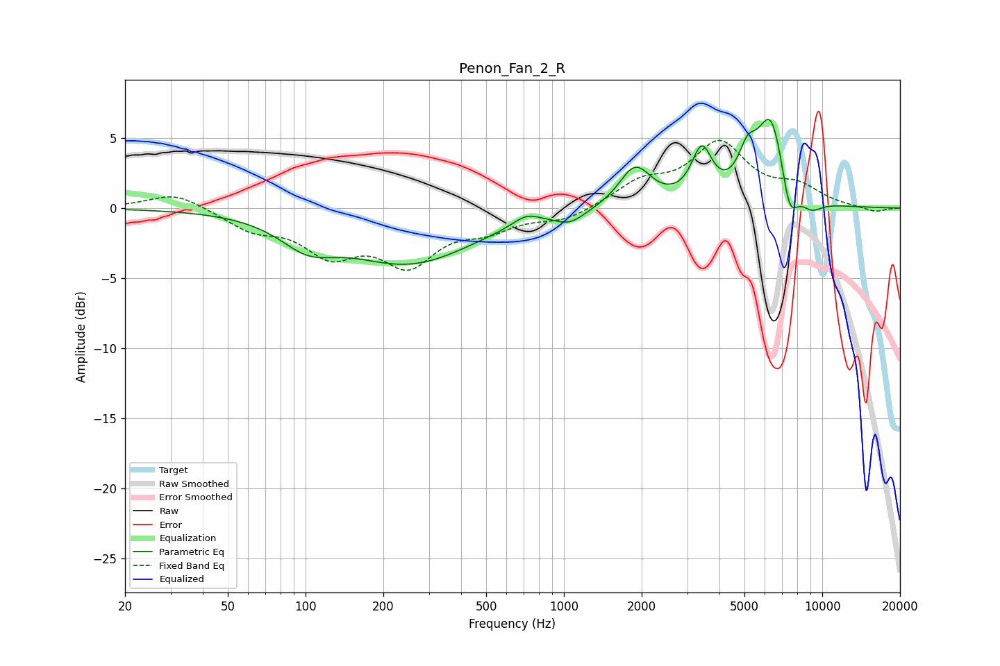

# Penon_Fan_2_R
See [usage instructions](https://github.com/jaakkopasanen/AutoEq#usage) for more options and info.

### Parametric EQs
Apply preamp of -6.4 dB when using parametric equalizer.

|   # | Type    |   Fc (Hz) |    Q |   Gain (dB) |
|-----|---------|-----------|------|-------------|
|   1 | Peaking |       102 | 1.35 |        -1.8 |
|   2 | Peaking |       253 | 0.56 |        -3.8 |
|   3 | Peaking |       715 | 2.68 |         0.7 |
|   4 | Peaking |      1055 | 2.42 |        -0.8 |
|   5 | Peaking |      1887 | 2.29 |         2.9 |
|   6 | Peaking |      3418 | 3.57 |         3.6 |
|   7 | Peaking |      5132 | 3.93 |         2.3 |
|   8 | Peaking |      6344 | 2.42 |         6.5 |
|   9 | Peaking |      7455 | 4.17 |        -3.1 |
|  10 | Peaking |      9073 | 2.98 |        -0.9 |

### Fixed Band EQs
When using fixed band (also called graphic) equalizer, apply preamp of **-4.9 dB** (if available) and set gains manually with these parameters.

|   # | Type    |   Fc (Hz) |    Q |   Gain (dB) |
|-----|---------|-----------|------|-------------|
|   1 | Peaking |        31 | 1.41 |         1.1 |
|   2 | Peaking |        62 | 1.41 |        -1.3 |
|   3 | Peaking |       125 | 1.41 |        -2.9 |
|   4 | Peaking |       250 | 1.41 |        -3.6 |
|   5 | Peaking |       500 | 1.41 |        -1.2 |
|   6 | Peaking |      1000 | 1.41 |        -0.8 |
|   7 | Peaking |      2000 | 1.41 |         1.7 |
|   8 | Peaking |      4000 | 1.41 |         4.4 |
|   9 | Peaking |      8000 | 1.41 |         1.3 |
|  10 | Peaking |     16000 | 1.41 |        -0.3 |

### Graphs

