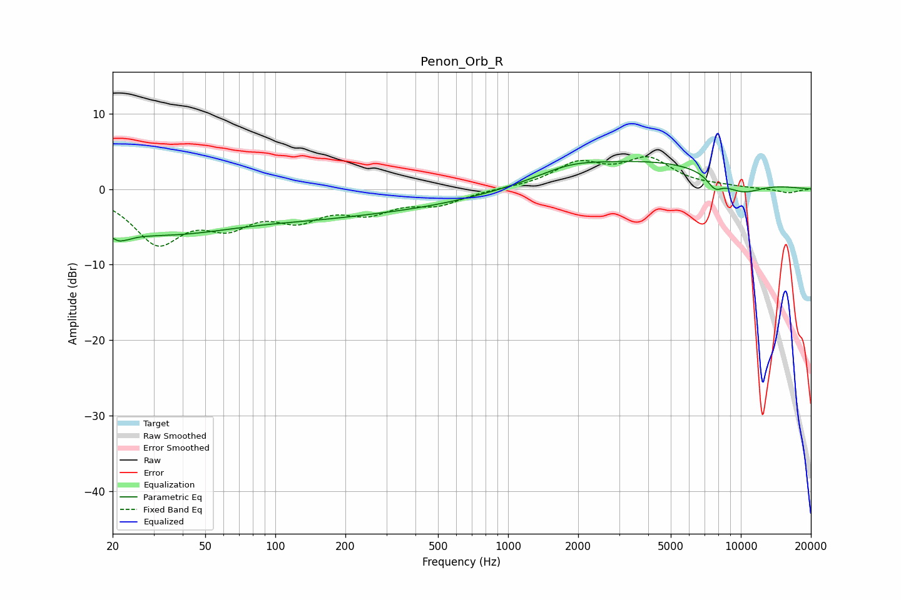

# Penon_Orb_R
See [usage instructions](https://github.com/jaakkopasanen/AutoEq#usage) for more options and info.

### Parametric EQs
Apply preamp of -3.8 dB when using parametric equalizer.

|   # | Type    |   Fc (Hz) |    Q |   Gain (dB) |
|-----|---------|-----------|------|-------------|
|   1 | Peaking |        22 | 5.11 |        -4.3 |
|   2 | Peaking |        22 | 5.74 |         3.3 |
|   3 | Peaking |        26 | 0.87 |         0.3 |
|   4 | Peaking |        27 | 0.32 |        -6.1 |
|   5 | Peaking |       142 | 0.66 |        -0.7 |
|   6 | Peaking |       301 | 0.37 |        -2.4 |
|   7 | Peaking |      1838 | 1.06 |         1.3 |
|   8 | Peaking |      4396 | 0.36 |         3.7 |
|   9 | Peaking |      7729 | 4.04 |        -1.6 |
|  10 | Peaking |     10000 | 1.21 |        -2.4 |

### Fixed Band EQs
When using fixed band (also called graphic) equalizer, apply preamp of **-4.4 dB** (if available) and set gains manually with these parameters.

|   # | Type    |   Fc (Hz) |    Q |   Gain (dB) |
|-----|---------|-----------|------|-------------|
|   1 | Peaking |        31 | 1.41 |        -6.7 |
|   2 | Peaking |        62 | 1.41 |        -3.8 |
|   3 | Peaking |       125 | 1.41 |        -3.3 |
|   4 | Peaking |       250 | 1.41 |        -2.6 |
|   5 | Peaking |       500 | 1.41 |        -1.8 |
|   6 | Peaking |      1000 | 1.41 |         0.1 |
|   7 | Peaking |      2000 | 1.41 |         3.2 |
|   8 | Peaking |      4000 | 1.41 |         3.7 |
|   9 | Peaking |      8000 | 1.41 |         0.2 |
|  10 | Peaking |     16000 | 1.41 |        -0.5 |

### Graphs

